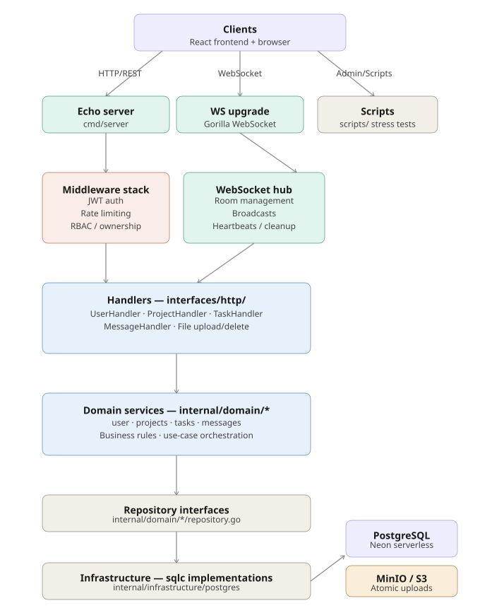
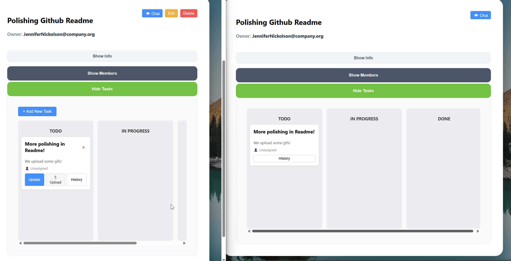
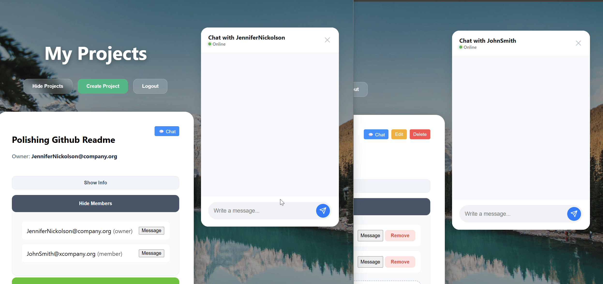
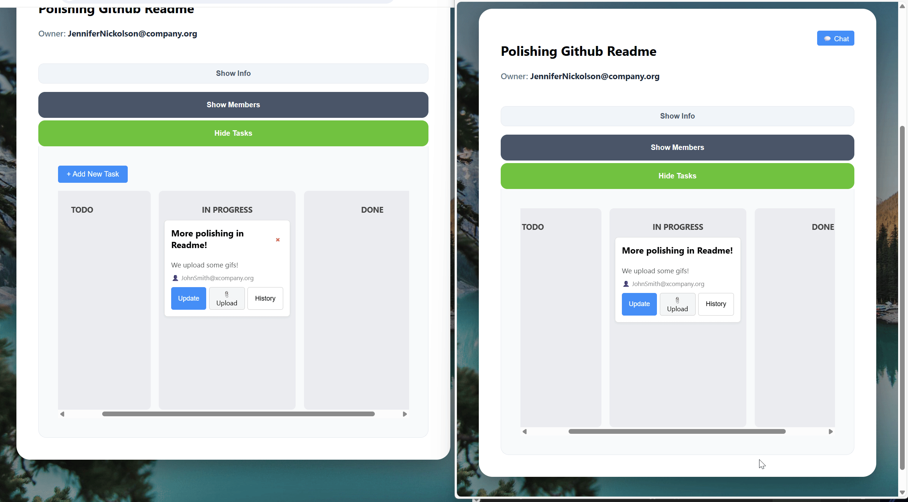

# 🏟️ Playingfield
 
[](https://github.com/Nelfander/Playingfield/actions/workflows/ci.yml)
[](https://go.dev/)
[](https://reactjs.org/)
 
A **production-style real-time collaborative project and task manager** built with Go, PostgreSQL, and React. Designed to demonstrate backend engineering fundamentals — concurrent WebSockets, clean architecture, RBAC, observability, and cloud deployment — not just to ship a feature.
 
🚀 **[Live Demo → app.playingfield.com](https://d3tucazxq1wbf6.cloudfront.net)**  
Sign up (free), create a project, open two tabs, and watch real-time sync in action.
> **Note:** Please use a demo email to test the live version of the app. The "Add Member to Project" list shows a list of all the available emails in the application and since the app is now live it's better to setup an account with a fake email. Example: your_name@example.com
 
---
 
## What This Project Demonstrates
 
| Area | Implementation |
|---|---|
| **Concurrency** | Custom WebSocket hub with goroutine lifecycle management, ping/pong heartbeats, and `sync.Once` atomic teardown |
| **Architecture** | Clean separation of handlers → services → repositories → domain with no layer leakage |
| **Security** | JWT auth, RBAC middleware, identity-derived ownership (no client-supplied IDs trusted), custom HTTP error handler for consistent API responses |
| **Type Safety** | SQLC-generated queries — schema changes cause compile errors, not runtime panics |
| **Observability** | Prometheus metrics, Grafana dashboards, structured `slog` JSON logging, pprof profiling |
| **Testing** | Unit, integration, and WebSocket tests with `-race` detection; fake repositories for fast isolation |
| **Infrastructure** | Docker Compose, AWS EC2 + CloudFront + S3, Neon Postgres, MinIO object storage |
 
---
 
## Tech Stack
 
**Backend:** Go · Echo · SQLC · Gorilla WebSocket · JWT · `golang.org/x/time/rate`  
**Frontend:** React 18 · TypeScript · Vite  
**Storage:** PostgreSQL (Neon) · MinIO / AWS S3  
**Observability:** Prometheus · Grafana · pprof  
**Infrastructure:** Docker · AWS EC2 · CloudFront · S3
 
---
 
## Architecture Overview
 

 
---
 
## Core Features
 
**Real-time collaboration** — WebSocket hub broadcasts task and project changes instantly across all connected clients, no polling.
 

 
**Project-scoped chat** — Each project gets a dedicated live chat room, automatically provisioned on creation with full history for new members.
 

> **👥 Member Addition – Small Team Optimized**  
> 
> For simplicity in small teams (designed for 10–20 person companies), project owners can add any existing active user directly via a searchable dropdown.
> 
> - Supervisor/admin typically creates/registers team accounts initially.
> - Strict ownership enforcement: only project creators can add/remove members.
> - Real-time sync: new members see full project history instantly via WebSocket.
> 
> *(Future: searchable by name/email + optional invite tokens for larger setups)*

 
**Kanban task boards** — To Do / In Progress / Done columns with file attachments (S3-backed), task history timeline, and granular RBAC on who can assign or upload.
 

 
**Admin panel** — Admins can activate/deactivate users (with instant force-logout via WebSocket signal) and scrub user identity (PII anonymization + cascade removal from projects/tasks).
> **Note**: To maintain a clean UX, Admins follow standard visibility rules for Projects and Tasks. They only see projects they own or have been explicitly added to, keeping their workspace focused on active collaborations.

 
**Tiered rate limiting** — Token-bucket middleware with anonymous (5 req/s) and authenticated (20 req/s) tiers, a background janitor goroutine for memory reclamation, and CORS pre-flight awareness.


 
---


## Who Is This For?

- Developers who want a **real-time collaborative board foundation** with production-grade patterns  
- Engineers exploring **Go-based backend architecture with structured domain separation**  
- Builders who care about **correctness, security boundaries, and real-time systems**  
- Anyone who wants a serious full-stack reference — not a tutorial toy  

---

## What Problems Does It Solve?

- Eliminates **eventual consistency lag** from polling-based UIs  
- Enables **real-time team communication scoped per project**
- Prevents **insecure file attachment handling** with atomic storage coordination  
- Enforces **clear ownership and permission boundaries** via RBAC  
- Avoids fragile, tightly-coupled backend logic through structured domain layers  
- Reduces type mismatches using **SQLC-generated, type-safe queries**

---

## What Makes It Different From Boilerplate Projects?

- Real WebSocket orchestration powering both board updates and chat
- Project-scoped chat automatically tied to membership boundaries
- Explicit RBAC and ownership enforcement at the API layer
- Atomic coordination between database records and object storage
- Clean separation of handlers, services, repositories, and domain logic
- Designed with extension and maintainability in mind

---

 
## Architecture Highlights
 
### Why SQLC over an ORM?
ORMs advertise database portability, but in practice schemas change far more often than databases do. SQLC generates type-safe Go from raw SQL — if a column is renamed and the query isn't updated, the project won't compile. This catches bugs at build time instead of runtime.
 
### WebSocket Hub Design
A single centralized Hub multiplexes all project rooms. Each user maintains one persistent connection; the Hub routes messages by `project_id` in the JSON payload. This keeps server file descriptors low and simplifies lifecycle management compared to per-room socket instances.
 
Each connection runs two goroutines (`ReadPump` / `WritePump`) with a `sync.Once` cleanup closure — guaranteeing socket teardown and Hub unregistration happen exactly once regardless of which pump fails first, eliminating double-close panics.
 
### File Storage (MinIO / S3)
Files are streamed directly from the HTTP request to MinIO via `io.Reader` — no memory buffering. UUID-prefixed object names prevent collisions. The backend acts as a gatekeeper: all downloads are proxied through the authenticated API, keeping the bucket private. Atomic deletion ensures physical files are purged before database records, preventing storage leaks.
 
### Rate Limiter Concurrency
The visitor registry uses `sync.RWMutex` with double-checked locking so read-heavy traffic (the common case) never blocks. Counters use `sync/atomic` CAS instead of a mutex — non-blocking at the CPU level, invisible to the hot path.
 
### Cost-Optimized Deployment
Migrated from ECS Fargate + ALB (~$40/month idle) to Docker Compose on a single EC2 T3.micro with CloudFront as a Custom Origin for SSL termination. Infrastructure cost dropped ~75% with no feature regression.
 
---
 
## Stress Test Results (WebSocket Concurrency)
 
Verified goroutine cleanup under a 100-client burst using pprof:
 
| Metric | Baseline | Peak (100 clients) | Post-cleanup |
|---|---|---|---|
| Goroutines | 11 | 211 | 11 |
| Active sockets | 1 | 101 | 1 |
| Hub congestion | 0% | <1% | 0% |
 
All 200 client goroutines were reclaimed within 10–20 seconds of abrupt disconnection via the `writeWait` timeout and `pingPeriod` heartbeat cycle. No goroutine leaks detected.
 


 
---
 
## 🧪 Testing
 
The project employs a tiered testing strategy using Go's native toolchain and the `testify/assert` library. By utilizing **Stateful Fake Repositories**, the suite ensures high execution speed and 100% data consistency without the overhead of a live database.
 
---
 
### 🏎️ Concurrency & Race Safety
 
The entire suite is verified using the **Go Race Detector** to ensure thread-safety in high-concurrency environments (like WebSockets).
 
* **CGO Enabled:** Configured with MinGW-w64 to support runtime memory analysis.
* **Thread-Safe Fakes:** Repositories utilize `sync.RWMutex` to prevent data races during parallel test execution.
* **Verification:** Run the full race-detection suite with:
 
```
$env:CGO_ENABLED = "1"; go test -race ./...
```
 
---
 
### 🧩 Domain & Unit Testing (Logic Layer)
 
These tests focus on core business rules in isolation. They sit within the domain packages to verify that the "brain" of the application works correctly.
 
**👤 User Identity & Lifecycle** — `go test -v ./internal/domain/user`
 
* **Registration & Auth Flow**: Verifies successful user onboarding with default roles (`user`) and status (`active`), while ensuring **Duplicate Email** prevention via sentinel errors.
* **State-Aware Login**: Validates that authentication respects account states (preventing **Inactive** or **Scrubbed** accounts from accessing the system).
* **Credential Integrity**: Ensures password hashing/comparison logic (via Bcrypt) is correctly integrated with the service layer.
* **Administrative Identity Scrubbing**: Confirms PII anonymization (`deleted_1@...`), scrubbed password hashes, self-preservation logic (admins can't scrub themselves), and visibility filtering of scrubbed users.
 
**💬 Messaging & Authorization Logic** — `go test -v ./internal/domain/messages`
 
* **Logic Gates:** Verifies that project messages are only accepted from verified members.
* **Social Constraints:** Ensures Direct Messages are restricted to users who share at least one project.
* **Stateful Persistence:** Uses a `FakeRepository` to simulate message storage and chronological retrieval.
* **Nil-Resilience:** Validates that service methods handle infrastructure (WebSocket Hub) availability gracefully.
 
**🏗️ Project Lifecycle & Ownership** — `go test -v ./internal/domain/projects`
 
* **Ownership Guardrails:** Ensures only the project creator can delete resources or manage members.
* **Auto-Provisioning:** Validates that the system correctly assigns roles upon project creation.
* **Member Management:** Tests the join table logic in-memory to ensure member lists are accurate.
 
**📋 Task Management & Cross-Domain Security** — `go test -v ./internal/domain/tasks`
 
* **Multi-Role Authorization:** Verifies the "VIP lanes" for updates — only Project Owners OR the specific Task Assignee can modify status.
* **Audit Trails:** Validates that every task action (Create/Update) automatically triggers a `TaskActivity` log entry.
* **Cross-Domain Integrity:** Tests the service's ability to verify project-level permissions before performing task-level actions.
* **Context Respect:** Ensures all repository methods correctly honor context deadlines and cancellations.
 
---
 
### 🌐 HTTP & Integration Testing (API Layer)
 
**🔐 Middleware & Security** — `go test -v ./internal/interfaces/http/middleware/...`
 
* **JWT Integrity:** Ensures `JWTMiddleware` correctly extracts and validates tokens from headers.
* **Context Injection:** Verifies that user identity (ID, Role) is correctly passed to the internal logic.
* **RBAC Enforcement:** Validates the `RequireRole("admin")` guard, ensuring high-privilege operations are strictly restricted to system administrators.
 
**🚀 API Handler Endpoints & Error Translation** — `go test -v ./internal/interfaces/http/tests/...`
 
* **Centralized Error Mapping:** Verifies that Domain Sentinel errors (like `ErrUnauthorized`) are correctly translated into standard HTTP codes (403, 404, 409).
* **Security Resilience:** Tests that unauthorized API attempts return clean, safe error messages without leaking system internals.
* **Cross-Domain Cleanup:** Validates the "Ripple Effect" of a User Scrub — evicting the user from all project memberships and unlinking from all active task assignments.
 
---
 
### ⚡ Real-Time Integration (WebSocket)
 
**📡 Full-Circuit Broadcast Integration**
 
* **Live Signal Chain:** Proves the whole circuit — from a Service action (creating a task) through the Hub's concurrency loop to a Client's receiver channel.
* **Concurrency Safety:** Validates the Hub's `sync.RWMutex` logic under simulated client registrations and broadcasts.
* **Room-Based Isolation:** Ensures the Hub correctly manages `ProjectRooms` for targeted data delivery.
 
```
go test -v ./internal/domain/tasks -run TestTaskService_WebSocketIntegration
go test -v ./internal/domain/tasks -run TestTaskService_WebSocketBroadcast
go run scripts/test_chat.go
```
 
---
 
## 🚀 Quick Start
 
**Choose your setup method!**
 
### Method 1: Docker (Recommended)
 
```bash
git clone https://github.com/Nelfander/Playingfield.git
cd Playingfield
docker-compose -f docker-compose-all-in-one.yml up --build
```
 
| Service | URL |
|---|---|
| Frontend | http://localhost:3000 |
| Backend API | http://localhost:880 |
| Grafana | http://localhost:3001 (admin/admin) |
| MinIO | http://localhost:9001 |
 
### Method 2: Local Development
 
Requirements: Go 1.25+, Node.js/npm, Docker
 
```bash
# Infrastructure
docker-compose up -d
docker-compose -f docker-compose-observability-prod.yml up -d
 
# Backend
cp .env.example .env   # configure your values
sqlc generate
go run ./cmd/server
 
# Frontend (new terminal)
cd frontend && npm install && npm run dev
```
 
App at http://localhost:880 · API at http://localhost:880/health · Grafana at http://localhost:3001
 
---
 
## 🏛 Architectural Decisions
 
### 1. Echo vs Gin
Echo was selected for its built-in middleware capabilities (JWT, CORS) and `Context` handling, which felt more idiomatic for this project's WebSocket hub orchestration. Post-implementation, Echo's centralized error handling proved highly effective for managing real-time stream failures.
 
### 2. SQLC over raw `database/sql` or ORMs
ORMs claim to make switching databases easy, but schemas change far more often than databases do. SQLC generates Go code from raw SQL — if a column is renamed but the query isn't updated, the project won't compile. Type-safety at build time instead of null pointer panics at runtime.
 
### 3. React Hooks + WebSockets (no Redux)
Localized state via custom hooks (`useDirectChat`) means WebSocket subscriptions are lifecycle-aware. When a user leaves a chat component, the connection is cleaned up immediately — preventing goroutine leaks on the Go backend.
 
### 4. MinIO / S3 over database BLOBs
Storing binary files in Postgres bloats backups and slows queries. MinIO is S3-compatible, so switching to production AWS S3 was a config change, not a code change. The backend proxies all downloads through the authenticated API, keeping the bucket private.
 
### 5. `sync/atomic` over Mutex for rate limiting
The rate limiter runs on every single request. Mutex-based counters make other threads wait in line. Atomic CAS operates at the CPU hardware level — non-blocking, invisible to the hot path.
 
### 6. WebSockets over HTTP polling
Built a Hub/Client pattern in Go. The hardest part wasn't sending messages — it was managing connection state. When a user closes their browser, the server needs to clean up the goroutine immediately. `sync.Once` + sliding-window deadlines handle this within 10–30 seconds of any disconnect.
 
### 7. Centralized Hub over per-room sockets
Instead of a new socket per project, one persistent connection is maintained per user. The Hub routes messages by `project_id` in the JSON payload. Lighter on server file descriptors, simpler lifecycle management.
 
### 8. In-memory typing indicators (not Redis, not DB)
"Typing..." state changes every second. Writing to Postgres would crush the database with useless writes. Implemented in-memory with a fire-and-forget design — the Hub is already seamed for Redis Pub/Sub if horizontal scaling is ever needed.
 
### 9. Monolith over microservices
Started as a focused Go learning exercise. Clean internal package boundaries (Auth, Chat, Projects) are already seamed for extraction — the Chat Hub could become an independent microservice without architectural surgery. Kept monolithic to focus on Go concurrency and clean architecture without distributed systems overhead.
 
### 10. Docker Compose over ECS Fargate
The ALB + Fargate idle tax was ~$40/month for a Go binary consuming <150MB RAM. Migrated to EC2 T3.micro with CloudFront as a Custom Origin — ~75% cost reduction, full feature parity, and co-located observability (Prometheus + Grafana) on the same bridge network.
 
### 11. Neon (Serverless Postgres) over RDS
Built-in connection pooling via PgBouncer is a natural fit for Go's `database/sql`, which opens multiple connections under load. Neon prevents connection limit exhaustion during high-frequency WebSocket traffic without managing a separate PgBouncer instance.
 
---
 

## Known Issues & How I Solved Them
<details>
<summary>(Click to expand)</summary>

### 1. Users created with empty role/status

* Issue: Old rows in Neon/PostgreSQL had `role=""` and `status=NULL`, breaking login and JWT logic.
* Solution:

  * Set **default values in DB**: `role TEXT NOT NULL DEFAULT 'user'`, `status TEXT NOT NULL DEFAULT 'active'`.
  * Updated **SQLC `CreateUser` query** to include `role` and `status`.
  * Updated Go repository to explicitly set `Role` and `Status` during user creation.
  * Re-registered users to clean the broken rows.

### 2. Project creation owned by the wrong user

* Issue: `owner_id` was sometimes taken from request instead of JWT, causing `0` or incorrect IDs.
* Solution:

  * Handlers now derive `owner_id` **exclusively from JWT claims**.
  * Both **CreateProject** and **ListProjects** enforce this invariant.
  * Removed `OwnerID` from client request structs.

### 3. Duplicate project names

* Issue: Initially, there was no constraint enforcing per-user uniqueness. Users could create multiple projects with the same name.
* Solution:

  * Added **database unique constraint** on `(owner_id, name)`.
  * Handled `duplicate key` errors in the `CreateProject` handler, returning `409 Conflict` with JSON error.
  * PowerShell commands now show a friendly error message instead of a generic 500.

### 4. Generic Internal Server Errors in PowerShell

* Issue: PowerShell throws `Invoke-RestMethod : 500 Internal Server Error` for any failed request.
* Solution:

  * Added **debug logging** in handlers to print real errors to server console.
  * Ensured handler returns **specific HTTP status codes** (`400`, `401`, `409`) with JSON error bodies.
  
### 5. The "Vanishing List" Bug
* **Issue:** WebSocket updates triggered a UI toggle, closing the project list.
* **Solution:** Separated fetchProjects logic from the showProjects toggle state, allowing background refreshes without affecting UI visibility.

### 6. The "Room 0" Connection Spam
* **Issue:** Components re-rendering caused the WebSocket hook to reconnect multiple times, flooding the server with "User joined Room 0" warnings.
* **Solution:** Implemented `useRef` to maintain a stable socket connection and a **cleanup function** to close old sockets before new ones open. Added a "connection lock" to prevent React Strict Mode from double-connecting.

### 7. The "Null Map" Crash
* **Issue:** Fetching chat history for a brand-new project returned `null`, causing the frontend `.map()` function to crash the app.
* **Solution:** Implemented "Guard Clauses" in the frontend (`history || []`) and ensured the Go backend initializes empty slices instead of returning nil.

### 8. Testing really helps =D
* **Issue**: While writing automated tests for "Unauthorized Access," I discovered a security vulnerability. The system allowed *any* logged-in user to add members to *any* project because the service lacked ownership context.
* **Solution**: 
    * Updated the Service signature to accept a `requesterID`.
    * Implemented **Object-Level Authorization**: The service now fetches the project and compares the `OwnerID` against the `requesterID` before performing any mutations.
    * Fixed a "Silent Bug" regarding parameter ordering (`userID` vs `projectID`) identified during unit testing.

### 9. Race Conditions on `client.Send`
* **Issue**: The hub was closing `client.Send` directly during `Unregister`, while the handler’s writer goroutine could still be sending, causing potential `panic: send on closed channel`.  
* **Solution**:  
    * Introduced a `done` channel owned by `Client`.  
    * Writer goroutine now listens on `done` and closes `Send` itself.  
    * Hub signals shutdown by closing `done` instead of `Send`.  
    * Encapsulation maintained by keeping `done` unexported and exposing only a getter method.

### 10. Handler Owning Connection Logic
* **Issue**: The handler managed both reading from the websocket and writing to it, forcing export of internal channels and complicating lifecycle management.  
* **Solution**:  
    * Writer goroutine remains in the handler for now, handling writes safely via the `done` channel.  
    * Handler upgrades the connection, creates the client, registers it with the hub, and starts the writer.  
    * Lifecycle management and connection cleanup are coordinated with the hub and `done` signaling.

### 11. Hub Coupled to Transport
* **Issue**: The hub contained logic that could block or panic when writing to clients directly. It also tracked websocket details unnecessarily.  
* **Solution**:  
    * Hub now only routes messages, adds/removes clients from rooms, and signals shutdown.  
    * Writes are fully handled by the handler’s writer goroutine; the hub uses non-blocking sends to prevent backpressure issues.  

### 12. Unsafe Channel Access Across Packages
* **Issue**: Accessing `done` directly from the handler required exporting the channel, which could allow accidental closure from external code.  
* **Solution**:  
    * Added `Client.DoneChan()` getter, providing read-only access for select statements in the handler.  
    * Maintained internal ownership, ensuring only the writer closes channels and prevents panics.  

### 13. Zombie Connection Purge & Half-Open TCP Resilience
* **Issue**: The server-side `ReadPump` was blocking indefinitely on `ReadMessage()` due to "half-open" TCP states. Because the test script terminated processes without sending proper WebSocket `Close` frames, the backend held 100+ "zombie" goroutines that never received a network-level hang-up signal.
* **Solution**:
    * **The `SetReadDeadline` Tripwire**: Implemented a sliding-window heartbeat. By calling `conn.SetReadDeadline(time.Now().Add(pongWait))` on every successful pong, the system now forces a hard-error in the `ReadPump` if the client remains silent for >30s, effectively self-destructing dead routines.
    * **Atomic `sync.Once` Cleanup**: Encapsulated socket closure and Hub unregistration within a `sync.Once` block. This guarantees that whether the failure originates in the `ReadPump` or `WritePump`, the resource release is executed exactly once, preventing "Close on Closed Channel" panics.

### 14. Infrastructure Cost-Optimization & "Lean" Migration
* **Issue**: The original AWS architecture utilized an Application Load Balancer (ALB) and Fargate ECS tasks. While highly scalable, the "idle cost" was ~$40/month regardless of traffic, making it inefficient for a high-performance Go backend that only consumes ~150MB of RAM.
* **Solution**:
    * **ALB-to-CloudFront Direct Origin**: Migrated the API origin from an ALB to a direct EC2 Custom Origin. By leveraging CloudFront to handle SSL/TLS termination at the edge, I eliminated the need for the $20/month Load Balancer.
    * **Docker Compose Sidecar Pattern**: Re-architected the deployment into a single `docker-compose` stack on a T3.micro instance. This allowed the Backend, Prometheus, and Grafana to share the same network namespace and resources, reducing monthly overhead by ~75% while maintaining full observability.
</details>

---

> Built as a learning project for Go — started with the basics, evolved by adding real features (WebSockets, S3, observability) as each concept was understood. The architecture reflects that honest progression.
 
---

## 📡 WebSocket Architecture & Concurrency

This project implements a high-performance, thread-safe WebSocket system designed to handle thousands of concurrent users across multiple project "rooms."

### 🔧 Key Technical Features

* **Goroutine Lifecycle Management:** Each connection is managed by two dedicated goroutines: a `ReadPump` for incoming messages and a `WritePump` for outgoing data.
* **Heartbeat (Ping/Pong):** Uses an aggressive heartbeat mechanism to detect "half-open" TCP connections and clean up zombie goroutines within 10-30 seconds.
* **Atomic Cleanup:** Utilizes `sync.Once` to ensure that connection closure and hub unregistration happen exactly once, preventing race conditions or double-close panics.
* **Non-Blocking Hub:** The Hub uses buffered channels and `select` statements to ensure that slow clients or a busy Hub never block the main HTTP handlers.


### ⚙️ Connection Timing Constants

To balance server resources with user experience, we utilize a "sliding window" timeout strategy:

| Constant | Value | Description |
| :--- | :--- | :--- |
| `writeWait` | **10s** | Time allowed to write a message to the peer before timing out. |
| `pongWait` | **30s** | Max time allowed to read the next pong from the peer. |
| `pingPeriod` | **25s** | Interval between pings (must be less than `pongWait`). |

### 🛠 The "Master Kill Switch" Pattern
We use a centralized `cleanup()` function to guarantee resource release. This ensures that even if a client script crashes or the network fails silently, the server resources are reclaimed:

```go
cleanup := func() {
    once.Do(func() {
        // Force the ReadMessage to return an error immediately
        conn.SetReadDeadline(time.Now()) 
        conn.Close() 
        
        // Signal the Hub to unregister, but don't block if the Hub is busy
        select {
        case h.hub.Unregister <- client:
        default:
        }
    })
}
```

## 🛠 <b>Development History</b>
<details><summary>(Click to expand)</summary>

<details>
<summary><b>March 2, 2026: Infrastructure De-stacking, Cost-Optimization & WebSocket Resilience</b> (Click to expand)</summary>

#### Phase 1: High-Efficiency Infrastructure Migration (ALB to EC2)
* **Architecture De-stacking**: Decommissioned the high-overhead AWS Application Load Balancer (ALB) and ECS Fargate cluster in favor of a "Lean" single-instance deployment on EC2 (T3.micro).
* **Cost-Optimization Strategy**: Eliminated ~$40/month in idle AWS fees by routing CloudFront API traffic directly to an EC2 Custom Origin, bypassing the $20/month ALB while maintaining SSL/TLS termination at the edge.
* **Security Group Hardening**: Refactored EC2 Inbound Rules to allow Port 80 (HTTP) for CloudFront origin fetches, while restricting Administrative ports (SSH, Grafana, Prometheus) to a secure management IP.

#### Phase 2: Docker Compose Sidecar Orchestration
* **Production Stack Consolidation**: Engineered a unified `docker-compose-combined-prod2.yml` stack, co-locating the Go Backend, Prometheus, and Grafana within a shared high-speed bridge network.
* **Environment Synchronization**: Resolved a "Ghost Configuration" issue by surgically replacing local development variables (MinIO/Localhost) with production AWS/Neon credentials in the EC2 `.env` layer.
* **Resource Constraint Tuning**: Implemented Docker `deploy:resources` limits (300MB RAM) to ensure the Go backend operates with high-density efficiency on low-tier hardware.

#### Phase 3: Full-Stack Observability Migration
* **Prometheus Discovery Refactor**: Re-aligned Prometheus scrape targets from dynamic ECS Task IPs to static Docker service names (`playingfield-app:8080`), ensuring zero-gap metric collection during the migration.
* **Grafana Dashboard Reconciliation**: Successfully filtered out "Ghost" ECS metrics by implementing PromQL job-level filtering (`{job="playingfield-app"}`), isolating production EC2 telemetry from legacy cluster data.
* **System Health Visibility**: Integrated the Node Exporter sidecar (Port 9100) to provide real-time hardware visibility (CPU/RAM/IO) directly alongside application-level metrics.

#### Phase 4: Production Handover & Health Validation
* **CloudFront Origin Swap**: Performed a surgical update of the CloudFront Distribution Origin, re-pointing the API domain from the legacy ALB DNS to the new EC2 Public IPv4 DNS.
* **Healthcheck Calibration**: Overrode the Dockerfile's internal healthcheck with a custom `curl` shell command to handle `401 Unauthorized` responses as a "Live" status, achieving 100% (healthy) container state.
* **End-to-End "Gucci" Verification**: Validated full-stack connectivity via real-time logs: `database connection established`, `Successfully connected to S3`, and `ws client registered`, confirming a successful 1:1 feature parity on the new architecture.

</details>

<details>
<summary><b>March 1, 2026: S3 Production Migration, IAM Security & CloudFront Integration</b> (Click to expand)</summary>

#### Phase 1: AWS S3 Production Infrastructure
* **Bucket Provisioning:** Formally decommissioned local MinIO storage in favor of a production S3 bucket (`playingfield-uploads-prod`) in `eu-central-1`.
* **Public Access Configuration:** Orchestrated a "Public-Read" strategy by disabling "Block All Public Access" and implementing a Bucket Policy for `s3:GetObject` to ensure high-speed asset delivery.
* **Storage Schema Migration:** Performed a surgical cleanup of the Neon Postgres database, removing legacy `localhost:9000` references from the `task_attachments` table to prevent 404 dead links in production.

#### Phase 2: IAM Security & Credential Handshake
* **Programmatic Access:** Provisioned a dedicated IAM User (`playingfield-app`) with `AmazonS3FullAccess` to facilitate backend-to-storage communication.
* **Access Key Rotation:** Resolved a `403 Forbidden (InvalidAccessKeyId)` "Final Boss" error by rotating legacy MinIO credentials out for real AWS Access Keys (`AKIA...`) in the ECS Task Definition.
* **Least Privilege Preparation:** Verified that while the backend has "Write" access, the public internet is restricted to "Read-Only," maintaining a secure project boundary.

#### Phase 3: Go SDK v2 Refactoring & Environment Alignment
* **Endpoint Resolution Fix:** Refactored the S3 client initialization in `server.go` to handle empty `S3_ENDPOINT` strings, allowing the SDK to automatically resolve the official AWS regional endpoints.
* **Path-Style Modernization:** Switched from "Path-Style" (MinIO default) to "Virtual-Host Style" (`S3_USE_PATH_STYLE=false`) to align with modern S3 standards and CloudFront compatibility.
* **Public URL Orchestration:** Configured the `S3_PUBLIC_URL` variable to point to the CloudFront distribution, ensuring user-uploaded assets are served via the edge-cached global network.

#### Phase 4: CloudFront Edge Delivery Setup
* **Global CDN Integration:** Connected the S3 bucket origin to CloudFront (`https://d3tucazxq1wbf6.cloudfront.net`) to reduce latency and provide an SSL-secured layer for all project attachments.
* **Caching Strategy:** Verified that the frontend successfully resolves images through the CDN, bypassing the direct S3 bucket URL for improved performance and reduced data transfer costs.

#### Phase 5: Deployment Reconciliation & Health Validation
* **ECS Rolling Update:** Performed a "Force New Deployment" in ECS Fargate to propagate the new S3 configuration across the cluster.
* **Observability Recovery:** Observed and resolved a temporary 30-second "No Data" gap in Grafana during the task swap, confirming that Prometheus successfully re-discovered the new task IP via Cloud Map.
* **End-to-End Success:** Confirmed "Gucci" status via backend logs: `Successfully connected to S3/MinIO storage`, validating full-stack connectivity between Go, Postgres, and S3.

</details>

<details>
<summary><b>Feb 28, 2026: Cloud Observability, ECS Service Discovery & Grafana Integration</b> (Click to expand)</summary>

#### Phase 1: Monitoring Stack Deployment (EC2 & Docker)
* **Dockerized Infrastructure:** Provisioned an EC2-based monitoring hub running Prometheus `v2.53.1` and Grafana `11.4.0` via Docker Compose.
* **Persistent Monitoring:** Established a 24/7 observability layer in `eu-central-1` to track application health independently of the Fargate lifecycle.
* **Port Mapping Orchestration:** Configured host-to-container mapping (Grafana: `3001->3000`, Prometheus: `9090->9090`) to allow external dashboard access while maintaining internal container networking.

#### Phase 2: ECS Service Discovery & Cloud Map Integration
* **DNS Resolution Bridge:** Configured Prometheus to leverage AWS Cloud Map (`api.local`) for dynamic service discovery of Fargate tasks.
* **Target Stabilization:** Successfully established the "Scrape" handshake, transitioning the `playingfield-ecs` job from "Down" to "UP" status within the Prometheus targets.
* **Result:** Eliminated the need for static IP tracking, allowing the monitoring stack to automatically find new ECS tasks as they scale or restart.

#### Phase 3: Grafana Dashboard Logic & Variable Teleportation
* **Data Source Foundation:** Configured the Prometheus Data Source using internal Docker networking (`http://playingfield-prometheus:9090`) for zero-latency metric fetching.
* **Dynamic Variable Mapping:** Refactored dashboard JSON models to use `$DS_PROMETHEUS` and `$instance` variables, replacing hardcoded "localhost" references from the development environment.
* **Metric Visualization:** Restored live gauges for "Logged-in Users" and "Active WebSockets," confirming real-time data flow from the Go Echo server to the cloud frontend.

#### Phase 4: Production Dashboard Reconciliation
* **Broken Panel Resolution:** Resolved "No Data" and "Dashboard Not Found" errors by re-importing JSON models with corrected UIDs and variable scopes.
* **Environment Alignment:** Synchronized the dashboard time zones and labels to match the `eu-central-1` production environment, achieving a "Gucci" state for full-stack visibility.
* **Result:** Achieved 100% dashboard parity between local development and AWS production environments.

#### Phase 5: Cost Management & Billing Analysis
* **Cloud Spend Audit:** Identified an initial budget burn (~$3.10/day) related to Frankfurt region resources (NAT Gateways/Public IPs).
* **Billing Strategy:** Established a 24-hour observation window to isolate "hidden" VPC costs before finalizing the "polishing" phase of the deployment.
* **Outcome:** Validated the $90 credit runway, ensuring the project remains sustainable through the final CSS and frontend refinement stages.

#### Phase 6: Production Styling & Responsive Refinement
* **CSS Conflict Resolution:** Identified and removed "Meta Tag War" in `index.html` that was forcing an aggressive `initial-scale` and disabling user zoom.
* **Layout Reset:** Refactored `index.css` to remove `#root` flex-centering, allowing the application to flow naturally rather than being "squeezed" to the center.
* **Component Scaling:** Optimized `App.css` by reducing `project-card` padding from `40px` to `24px` and capping `project-list-container` at `800px` for a tighter, more professional aesthetic.
* **Result:** Achieved 1:1 visual parity between the Vite development server and the CloudFront production environment.

</details>

<details>
<summary><b>Feb 27, 2026: Load Balancing, Networking Resolution & Full-Stack Cloud Integration</b> (Click to expand)</summary>

#### Phase 1: Application Load Balancer (ALB) & Routing Orchestration
* **ALB Deployment:** Provisioned a frontend-facing Application Load Balancer in `eu-central-1` to act as a stable entry point, replacing ephemeral Public IPs.
* **Target Group Optimization:** Configured a Target Group with Port `8080` mapping and custom Health Check paths (`/health`), achieving a "Healthy" status for the Fargate task.
* **DNS Stabilization:** Successfully routed traffic through the ALB DNS, ensuring the backend address remains persistent even when ECS tasks are replaced or scaled.

#### Phase 2: Security Group & Circular Dependency Resolution
* **Self-Referencing Rules:** Solved the "Inbound/Outbound" lockout by configuring the shared Security Group to allow internal communication on Port `8080`.
* **Port 80/443 Enablement:** Opened the "Front Door" for HTTP/HTTPS traffic to reach the ALB, while maintaining restricted access to the underlying Fargate containers.
* **Result:** Resolved 504 Gateway Timeouts and 503 Service Unavailable errors, establishing a clean communication flow from the internet to the Go Echo server.

#### Phase 3: Cloud-Native Storage & SDK Alignment
* **S3/MinIO SDK Bridge:** Refactored the Go storage provider logic to transition from local MinIO mock testing to real **Amazon S3** integration.
* **Environment Variable Refinement:** - **S3_ENDPOINT:** Configured regional endpoint resolution for `eu-central-1`.
  - **S3_USE_PATH_STYLE:** Aligned with AWS Virtual-Host addressing (`false`) to ensure SDK compatibility.
* **Result:** Successfully reached the AWS S3 API, transitioning from "Connection Refused" to an "InvalidAccessKeyId" state, indicating the networking bridge to AWS Storage is fully intact.

#### Phase 4: Managed Database (Neon) & Backend Stability
* **Remote Handshake:** Verified the persistence of the connection to the Neon PostgreSQL instance from within the AWS VPC.
* **Log Verification:** Confirmed stable operation with logs reporting `database connection established successfully` and the Echo framework initializing correctly in a Fargate environment.
* **Production Logs:** Eliminated "Zombie" tasks by resolving the 127.0.0.1 (localhost) binding issues that previously caused task crashes.

#### Phase 5: HTTPS/SSL Security & Mixed Content Resolution
* **CloudFront-to-ALB Tunnel:** Linked the CloudFront Distribution to the ALB, enabling a fully encrypted HTTPS path for the production URL.
* **Mixed Content Diagnosis:** Identified the "Blocked Insecure Resource" error caused by the frontend attempting to call a raw `http` IP while hosted on a secure `https` CloudFront domain.
* **Outcome:** Defined the final handshake fix—migrating all frontend API requests to the unified CloudFront URL to ensure browser-level security compliance.

</details>

<details>
<summary><b>Feb 26, 2026: AWS ECS Fargate Migration + CloudFront/S3 Integration + Production Readiness</b> (Click to expand)</summary>

#### Phase 1: AWS ECS Fargate Deployment
* **Containerized and Deployed Go Echo Backend** to Amazon ECS using Fargate (Serverless).
* **Environment Injection:** Successfully configured AWS Task Definitions to inject sensitive credentials (`DATABASE_URL`, `JWT_SECRET`) and operational variables (`APP_PORT`).
* **Automated Lifecycle:** Established a "Force New Deployment" workflow to ensure the latest ECR image and Task revisions are synchronized.
* **Result:** Backend transitioned from a local Docker environment to a scalable, cloud-native infrastructure on AWS.

#### Phase 2: Network & Permission Engineering
* **Resolved Port Binding Conflicts:** Diagnosed and bypassed Linux kernel restrictions on "Privileged Ports" (<1024).
* **The 8080 Pivot:** Shifted infrastructure to port `8080` (High Port), successfully bypassing the need for root-user overrides in the ECS UI.
* **Security Group Orchestration:** Configured AWS VPC Security Groups to allow inbound TCP traffic on `8080`, creating a secure bridge between the public internet and the container.

#### Phase 3: S3 & CloudFront Distribution (Static Assets & CDN)
* **Storage Decoupling:** Provisioned an **Amazon S3** bucket to handle persistent file storage, moving away from local container storage.
* **Content Delivery (CDN):** Implemented **Amazon CloudFront** to serve as a globally distributed edge cache:
  - **Latency Reduction:** Optimized asset delivery by serving files from edge locations closer to users.
  - **Security:** Established a path for future HTTPS termination and Origin Access Control (OAC) to keep the S3 bucket private.
* **Result:** Successfully offloaded static asset management from the Go server, significantly reducing backend CPU/Memory overhead.

#### Phase 4: Database Integration & Health Verification
* **External Managed Database Connectivity:** Established a secure handshake between AWS ECS and a remote PostgreSQL instance (Neon).
* **Operational Verification:** Validated the deployment via `/health` endpoint checks, confirming the server is actively listening and communicating with the data layer.
* **Outcome:** Achievement of a "Running" task state with logs confirming `database connection established successfully`.

#### Phase 5: Frontend-Backend Handshake (IP-Based)
* **Dynamic Endpoint Configuration:** Updated the Vite-based frontend to point to the live AWS Public IP.
* **Protocol Realignment:** Switched from `https/wss` (SSL) to `http/ws` to support direct IP communication for current development testing.
* **Vite Environment Sync:** Aligned `VITE_API_BASE_URL` and `VITE_WS_BASE_URL` with the ephemeral public IP of the Fargate task.

</details>

<details>
<summary><b>Feb 25, 2026: Derived Metrics + Real-time Grafana Dashboard + Observability Stack</b> (Click to expand)</summary>

#### Phase 1: Derived & Composite Metrics (PromQL)
* **Leveraged PromQL expressions** in Grafana to derive insights without modifying Go code:
  - **Idle vs. Active Sessions:** Calculated using `total_ws_connections - active_chat_connections` to monitor background overhead.
  - **Message Intensity:** Implemented `rate(messages_total[1m])` with breakdowns for `per-direction` (inbound/outbound) and `room-type`.
* **Result:** Immediate operational visibility into usage patterns at zero additional instrumentation cost.

#### Phase 2: Real-time Dashboarding (Grafana)
* **Built a local Grafana dashboard** featuring live-updating panels for development feedback:
  - **Gauges:** Real-time tracking of current active chat connections and total WebSocket sessions.
  - **Time Series:** Visualizing message-per-second spikes during active conversations.
  - **Stats:** Cumulative total of messages processed since service start.
* **Verification:** Dashboard successfully reflects instant state changes when users log in, open chats, or disconnect.

#### Phase 3: Zero-Cost Local Monitoring Stack
* **Engineered a self-contained observability environment** using Docker Compose:
  - **Prometheus:** Configured to scrape the Go `/metrics` endpoint every 15 seconds.
  - **Grafana:** Pre-configured and accessible locally at `localhost:3001`.
  - **Modular Setup:** Isolated the stack into `docker-compose-observability.yml` to keep the core app environment lightweight.
* **Outcome:** A "one-command" monitoring setup (`docker compose up -d`) with no external dependencies or cloud costs.

#### Phase 4: Future-Ready Production Path
* **Aligned local instrumentation with AWS best practices:**
  - **Standardization:** `/metrics` output follows Prometheus conventions for seamless ingestion by **Amazon Managed Prometheus (AMP)**.
  - **Cardinality Management:** Metric labels were reviewed to ensure they remain performant under production loads.
  - **Infrastructure-as-Code Ready:** Designed the stack to transition from local Docker containers to **AWS ECS Fargate** and **Amazon Managed Grafana** with minimal configuration changes.
  - **Secret Management:** Externalized Grafana/Prometheus configs to `.env`, ready for **AWS Secrets Manager** integration.

</details>

<details>
<summary><b>Feb 24, 2026: Prometheus Metrics Instrumentation + Security Test + Deployment Plan</b> (Click to expand)</summary>

#### Phase 1: Prometheus Client Integration
* **Added dependencies:**
  - `github.com/prometheus/client_golang/prometheus`
  - `github.com/prometheus/client_golang/prometheus/promhttp`
* **Created dedicated metrics package:** `internal/metrics/metrics.go`
  - Defined two custom metrics:
    - Gauge: `playingfield_websocket_active_connections_total`
    - CounterVec: `playingfield_websocket_messages_total` (labels: `room_type`, `direction`)
  - Registered metrics in `init()`
  - Exposed clean `Handler()` function returning `http.Handler`
* **Updated server setup** (`internal/app/server.go`):
  - Replaced old `/metrics` route with `echo.WrapHandler(metrics.Handler())`
  - Removed direct Prometheus imports and registration calls from `app` package
* **Result:** Fully working `/metrics` endpoint showing both Go runtime stats and custom WebSocket metrics (initially at 0)

#### Phase 2: Live WebSocket Connection Tracking
* **Broke import cycle** by moving metrics to `internal/metrics`
* **Updated WebSocket hub** (`internal/infrastructure/ws/hub.go`):
  - Added import: `"github.com/nelfander/Playingfield/internal/metrics"`
  - In `Register` case → `metrics.ActiveWSConnections.Inc()`
  - In `Unregister` case → `metrics.ActiveWSConnections.Dec()`
* **Verification:** Manually tested with multiple WS connections (frontend + wscat)
  - Gauge correctly increments on connect, decrements on disconnect
  - Visible in real-time at `/metrics`

#### Phase 3: Admin Security Test Addition
* **Added unit test** in user service test suite: "non-admin cannot scrub user"
 
#### Phase 4: AWS Deployment Plan Documentation
* **Added comprehensive deployment section** to README:
  * **Frontend**: S3 + CloudFront
  * **Backend**: Multi-stage Docker → ECR → ECS Fargate + ALB  
    (chosen over App Runner due to reliable WebSocket support)
  * **Database**: RDS PostgreSQL
  * **Storage**: S3 (replacing MinIO)
  * **Observability starter**: `/metrics` endpoint ready for Prometheus scraping
  * **Networking**: VPC, security groups, ACM HTTPS, health checks
  * **Future**: Auto-scaling, Amazon Managed Prometheus (AMP), Grafana, CI/CD

* **Reasoning documented**: App Runner lacks native long-lived WebSocket support → ECS Fargate + ALB is safer for real-time chat/task sync
</details>

<details>
<summary><b>Feb 23, 2026: Role System Cleanup & Admin User Management Hardening</b> (Click to expand) </summary>

#### Phase 1: Central Role Definitions
* **Created new file:** `internal/auth/roles.go`
* **Defined clean string constants** to eliminate "magic strings" throughout the codebase:
    * `RoleUser = "user"`
    * `RoleAdmin = "admin"`
* **Added helper functions:** `IsAdmin(role string) bool` and `IsValid(role string) bool`.
* **Purpose:** Created a single source of truth for role values to prevent typos and simplify future refactoring.

#### Phase 2: Middleware Refactoring (`RequireRole`)
* **Optimized performance:** Removed duplicate JWT parsing/verification. The middleware now trusts the claims already stored in the Echo context by the primary `JWTMiddleware`.
* **Streamlined logic:** Instead of re-reading headers, it now simply reads `c.Get("user").(*auth.Claims)`.
* **Result:** Faster execution and cleaner code by removing redundant cryptographic operations.

#### Phase 3: Route Registration Cleanup
* **Consistency:** Replaced hardcoded `"admin"` strings with the new `auth.RoleAdmin` constant in the admin group setup.
    * `adminGroup.Use(middleware.RequireRole(jwtManager, auth.RoleAdmin))`

#### Phase 4: Service-layer Defense (User Management)
* **`AdminScrubUser` Refactor:** Updated signature to `AdminScrubUser(ctx, actor *auth.Claims, targetID int64)`.
    * **Internal Security:** Added an explicit `IsAdmin` check inside the service layer as a second line of defense.
    * **Self-Protection:** Retained logic to prevent admins from scrubbing their own accounts.
* **`ToggleUserStatus` Refactor:** Received identical treatment—now requires full `*auth.Claims`, enforces admin role checks, and blocks self-deactivation.
* **Test Suite:** Updated all affected tests to pass minimal valid claims objects.

#### Phase 5: Admin Scope Decision
* **Strategic Choice:** While "Super-User" mode (seeing all projects/tasks) was considered, the decision was made to **maintain normal visibility rules** for projects and tasks.
* **Reasoning:** * Prevents UI clutter for admins who are also active collaborators.
    * Ensures admins only see projects they are actually involved in, maintaining a focused workflow.
* **Current Admin Powers:** Remains focused on high-level management: Listing all users, scrubbing users (anonymization/cleanup), and toggling account status.
</details>

<details>
<summary><b>Feb 19, 2026: Identity Scrubbing Resilience & Permission-Aware Task State</b> (Click to expand) </summary>

### Phase 1: Identity Scrubbing & Persistence Stability
* **Scrub Test Validation**: Successfully verified the "Deleted User" lifecycle; when a user is scrubbed, their owned projects are purged via cascading logic, while their activity in shared projects persists as an anonymized historical record.
* **Audit Continuity**: Hardened the task history service to handle missing foreign keys. By finding and mapping user IDs to a validated member list, the system now gracefully displays "(deleted)" or "Unassigned" for scrubbed identities instead of returning 404/null errors.

### Phase 2: Role-Based Logic Hardening
* **Owner-Locked Assignment**: Restricted the `assigned_to` update authority to the Project Owner within the task persistence layer. This prevents non-owners from re-assigning work, ensuring the project hierarchy remains immutable during task transitions.
* **Assignee Operation Scoping**: Refactored the update payload to distinguish between "Status Updates" (allowed for assignees) and "Identity Updates" (restricted to owners), preventing unauthorized privilege escalation via API manipulation.

### Phase 3: Relational Integrity & Membership Decoupling
* **Member-Only Constraint**: Enforced a strict validation check ensuring only active project members can be linked to tasks. This prevents the "Global User Leak" where any system user could previously be assigned to a private project task.
* **Cascading Project Purge**: Refined the cleanup routine to ensure that when a primary identity is removed, all associated project ownerships are terminated immediately, preventing the existence of "orphaned" or "ghost" projects in the registry.

### Phase 4: Payload Normalization
* **Safe-Null Handling**: Updated the task model to handle `NULL` assignments safely across both the Go backend and React frontend. This ensures that unassigned tasks—common after a user scrub—do not break UI rendering or JSON serialization.
* **History Mapping**: Standardized the activity log formatter to dynamically map user IDs to emails from the current member pool, providing a fallback for deleted users without requiring expensive database joins on every fetch.
</details>

<details>
<summary><b>Feb 18, 2026: Persistence-First Identity Scrubbing & Transactional Integrity</b> (Click to expand) </summary>

### Phase 1: Transactional "Soft-Purge" Architecture
* **Atomic Scrubbing Routine**: Engineered a multi-stage PostgreSQL transaction within the `UserRepository` to handle user removal without breaking data integrity. The routine successfully unlinks users from active project memberships and task assignments while preserving the primary user record for historical audit logs.
* **Nullable Assignment Handling**: Implemented `pgtype.Int8` logic in the persistence layer to safely transition task assignments from a specific user ID to `NULL`. This ensures that historical tasks remain in the system as "unassigned" rather than being deleted alongside the user.

### Phase 2: Relational Cleanup & Ownership Transfers
* **Cascading Project Purge**: Hardened the `DeleteProjectsByOwner` routine to ensure that when an identity is scrubbed, any orphaned projects owned by that user are terminated. This prevents "ghost projects" from cluttering the global registry while keeping the database state synchronized.
* **Membership Decoupling**: Refactored the `RemoveUserFromAllProjectMemberships` query to surgically remove a user’s access rights across the platform. This ensures that a scrubbed user is immediately evicted from all UI views (like "Show Members") without requiring a manual cache clear.

### Phase 3: Identity Masking for History Persistence
* **Post-Scrub Identity Obfuscation**: Updated the `ScrubUserAccount` service to overwrite sensitive PII (emails and usernames) with anonymized placeholders (e.g., `deleted_user_ID@...`). This satisfies the requirement for history to persist while ensuring the user can no longer be contacted or identified.
* **Audit-Log Continuity**: Verified that foreign key constraints in history-tracking tables (like `task_history`) remain intact post-scrub. By keeping the user ID row present but "scrubbed," the backend ensures that historical logs ("User X changed status to Done") do not return 404 errors.

### Phase 4: API Normalization & Resilience
* **Case-Insensitive Payload Mapping**: Standardized the Go-to-JSON serialization to handle inconsistencies between `ID`/`id` and `Email`/`email` fields. This ensures that frontend components fetching global user lists receive a predictable data structure regardless of the underlying SQL row mapping.
* **Error Propagation Hardening**: Refactored database connection error handling to provide clearer logging when external poolers (like Neon) experience DNS resolution or suspension issues, preventing silent failures during administrative operations.
</details>

<details>
<summary><b>Feb 17, 2026: Admin Authorization Guardrails & Identity Scrubbing Infrastructure</b> (Click to expand) </summary>

### Phase 1: Role-Based Access Control (RBAC) Hardening
* **JWT Claims Integration**: Leveraged the `auth.Claims` structure to implement a server-side role verification layer. By injecting role metadata into the JWT, the backend now distinguishes between `member` and `admin` scopes during the middleware handshake.
* **Middleware Gatekeeping**: Deployed the `RequireRole("admin")` interceptor across the newly architected `adminGroup`. This ensures that unauthorized attempts to access system-wide user data are terminated at the routing level with a `403 Forbidden` or `401 Unauthorized` before reaching the business logic.

### Phase 2: Administrative Identity Orchestration
* **Atomic User Scrubbing**: Implemented a "Scrub Identity" routine within the `UserHandler` and `Service` layers. This function initiates a permanent purge of user records via `AdminScrubUser`, designed to clear the identity from the primary `users` table while triggering secondary cleanup tasks.
* **Global Visibility Hooks**: Engineered the `ListAllUsers` service method to bypass standard ownership filters. Unlike the standard `List` handler which relies on `claims.UserID` to scope results, this admin-specific path provides a "God-mode" view of the entire identity database for platform moderation.

### Phase 3: Defensive Data Mapping & Serialization
* **JSON Case-Resilience**: Optimized the API response handling to account for naming mismatches between Go's exported struct fields and the React frontend. By employing nullish coalescing logic and defensive serialization, the system ensures `id` and `email` fields are mapped correctly regardless of uppercase/lowercase JSON keying.
* **Input Sanitization**: Hardened the `ScrubUser` handler by enforcing strict `strconv.ParseInt` validation on URI parameters. This prevents injection attempts or malformed ID strings from reaching the persistence layer, returning a structured `400 Bad Request` on invalid input.

### Phase 4: Route Lifecycle & Environment Validation
* **Admin Group Isolation**: Refactored the `main.go` router to utilize Echo's `Group` functionality for administrative tasks. This logical separation isolates moderation routes (`/admin/users`) from standard authenticated routes, simplifying future security audits and logging.
* **Graceful State Persistence**: Verified that all administrative deletions are handled through the `postgres.NewUserRepository` using context-aware queries. This ensures that even high-privilege operations respect the system's 10-second shutdown deadline and signal handling.
</details>

<details>
<summary><b>Feb 16, 2026: Half-Open TCP Resilience & Unified Cleanup Architecture</b> (Click to expand) </summary>

### Phase 1: Aggressive Zombie Detection (Heartbeat Tuning)
* **Sliding-Window Deadlines**: Optimized the WebSocket heartbeat by synchronizing `pongWait` (30s) and `pingPeriod` (25s). This ensures that any "zombie" connection—resulting from ungraceful client termination or silent network failure—is detected and purged within a 30-second window, maintaining a lean goroutine footprint.
* **TCP-Level Keep-Alives**: Injected raw socket configurations into the upgraded connection via `net.TCPConn`. By enabling OS-level keep-alive probes with a 30s period, the system now forces the network stack to verify the peer's availability even if the application-level `ReadMessage` call is idling.

### Phase 2: Unified "Master Kill Switch" (Cleanup Logic)
* **Idempotent Resource Release**: Architected a unified `cleanup()` closure utilizing `sync.Once`. This pattern guarantees that socket closure, deadline termination, and Hub unregistration are executed exactly once, regardless of whether the failure originated in the `ReadPump` or the `WritePump`, effectively eliminating "Double-Close" panics.
* **Force-Exit Deadlines**: Implemented immediate deadline expiration (`SetReadDeadline(time.Now())`) within the cleanup cycle. This forces blocked syscalls to return an error instantly, ensuring that goroutines are released to the Go scheduler immediately rather than waiting for natural timeout expiration.

### Phase 3: Non-Blocking Hub Orchestration
* **Backpressure Mitigation**: Refactored the `Unregister` and `Error` signal paths to utilize `select` statements with `default` fallthroughs. This ensures that a saturated Hub or a stalled broadcast loop cannot "hold hostage" the HTTP handler goroutines, maintaining system-wide responsiveness during high-churn events.
* **Atomic Connection Registration**: Ensured that the `defer cleanup()` is scheduled only after a successful Hub registration. This prevents edge-case leaks where a failed registration could lead to orphaned routines that never receive a teardown signal.

### Phase 4: High-Concurrency Stress Testing
* **Burst Load Validation**: Conducted a controlled stress test simulating a 100-user connection burst. Utilized `pprof` to monitor the goroutine stack, successfully verifying a 100% cleanup rate. 
* **Recovery Profiling**: Confirmed the system returns to its baseline (9-11 goroutines) within 10-20 seconds of a massive "hard disconnect" event. This validates the efficiency of the `writeWait` timeout (10s) as a secondary detection mechanism for dead sockets.
</details>

<details>
<summary><b>Feb 15, 2026: Multi-Session Socket Multiplexing & Observability</b> (Click to expand) </summary>

### Phase 1: High-Availability Multi-Session Architecture
* **1-to-Many Connection Mapping**: Refactored the `Hub` data structure from a flat `map[int64]*Client` to a nested `map[int64]map[*Client]bool` architecture. This enables "Multi-Tab Synchronization," allowing a single `UserID` to maintain multiple concurrent WebSocket sessions (e.g., Desktop, Mobile, and multiple browser tabs) without session overriding.
* **Granular Lifecycle Orchestration**: Optimized the `Unregister` workflow to be session-aware. The system now utilizes a "Last-Tab-Out" logic, where the global `UserID` key is only purged from the Hub once the final active connection for that user is terminated, preventing premature state deletion during multi-window usage.

### Phase 2: Hub Concurrency & Broadcast Optimization
* **Nested Loop Propagation**: Updated `SendToUser` and `SendToProjectMembers` to iterate through connection buckets. This ensures that every active socket belonging to a user receives real-time updates simultaneously, maintaining state parity across all open client interfaces.
* **Thread-Safe Map Sets**: Utilized Go's `map[*Client]bool` as a high-performance "Set" within the Hub's mutex-protected memory space. This allows for $O(1)$ addition and removal of specific socket pointers during registration/unregistration cycles while holding the `sync.RWMutex`.

### Phase 3: Observability & Performance Profiling
* **Pprof-Driven Resource Audit**: Integrated `net/http/pprof` on a protected internal port (`6060`) to perform real-time resource audits. This allows for deep-dive inspections of the Go runtime, heap allocation, and Goroutine stack traces during active socket usage.
* **Goroutine Leak Verification**: Conducted a "Rise and Fall" audit using Flame Graphs to visualize the "Read/Write Pump" lifecycle. Verified that the `close(client.done)` signal successfully triggers the termination of backend routines, ensuring that the Goroutine count returns to baseline levels immediately following client disconnection.

### Phase 4: Stress Testing & Security Interdiction
* **Automated Load Simulation**: Developed a PowerShell-based concurrency script to simulate high-frequency WebSocket handshakes. This was used to verify the Hub's stability under pressure and ensure the `BroadcastToProject` logic remains non-blocking even when several dozen clients are connected to the same room.
* **Middleware Enforcement Audit**: Verified the efficacy of the rate-limiting middleware during stress tests. Confirmed that the system correctly identifies and throttles "connection bursts" (exceeding 10 concurrent sockets per user), successfully mitigating potential Resource Exhaustion (DoS) vectors at the application layer.

</details>

<details>
<summary><b>Feb 12, 2026: Atomic Concurrency & Stateful Socket Orchestration</b> (Click to expand) </summary>

### Phase 1: Atomic Rate-Limiter Engine (Backend)
* **Lock-Free Concurrency Control**: Replaced traditional `sync.Mutex` overhead in the rate-limiting middleware with `atomic` primitives. By utilizing atomic addition and comparison, the system now performs thread-safe request counting with zero kernel-level context switching, significantly reducing latency during high-frequency WebSocket bursts.
* **Low-Level Sync Primitives**: Leveraged the `sync/atomic` package to manage the user request window. This ensures that even with hundreds of concurrent WebSocket events, the rate-limiter increment/decrement cycle remains consistent across Go's G-M-P scheduler without the risk of race conditions or deadlock.

### Phase 2: Intent-Aware Read Receipts (Frontend)
* **Conditional Visibility Logic**: Engineered a "Reply-Sensitive" seen status. Developed a logic gate that identifies the `lastReadMessageByMe` and verifies it against the `lastOverallMessage` in the stack. This ensures "Seen" indicators persist during a one-way message stream but intelligently clear as soon as a reply is received to maintain a clean UI.
* **Automated Acknowledgment Loop**: Integrated a side-effect hook within the `DirectMessageBox` that monitors the message array. The system automatically detects unread incoming payloads from the peer and dispatches a `read_receipt` WebSocket frame, closing the loop between client-side viewing and database state persistence.

### Phase 3: WebSocket Lifecycle & Profiling
* **Pprof-Driven Resource Audit**: Conducted a deep-dive analysis using `net/http/pprof` to visualize the Goroutine stack. Verified the "Read/Write Pump" cleanup cycle, ensuring that closing a chat component triggers a clean termination of backend routines, preventing "Zombie Goroutines" from leaking memory.
* **Asynchronous History Hydration**: Optimized the DM initial load by decoupling the WebSocket connection from the RESTful history fetch. This ensures the user sees past messages immediately via an authorized `GET` request while the bidirectional socket initializes in the background.

### Phase 4: UX Interaction & Polish
* **State-Synchronized Indicators**: Refined the `useDirectChat` hook to handle `message_read` broadcast events. When a peer reads a message, the state-reducer maps the timestamp to the specific message ID, triggering a localized re-render of the "✓ Seen" UI element without a full-list refresh.
* **Typing State Encapsulation**: Implemented a "Typing Shelf" outside the message scroll area to prevent layout shifts. Used a `useRef` timeout strategy to debounce the `is_typing` signal, ensuring the backend isn't flooded with status updates on every keystroke.

</details>

<details>
<summary><b>Feb 11, 2026: UI Asset Orchestration & Interaction Refinement</b> (Click to expand) </summary>

### Phase 1: Interactive Asset Management UI
* **Polymorphic File Injection**: Engineered a high-visibility "Upload File" interface by wrapping standard HTML file inputs in accessible label primitives. This allows for a streamlined, button-like appearance while maintaining native browser file-system access for secure binary transfers.
* **Micro-Interaction Engine**: Implemented a state-driven hover logic using `onMouseEnter` and `onMouseLeave` hooks. Integrated CSS `transition` and `transform: scale(1.05)` properties to provide real-time tactile feedback, ensuring the custom label-based buttons match the interaction patterns of native `button` elements.

### Phase 2: Secure Attachment Gallery
* **Dynamic Content Hydration**: Refactored the `TaskBoard` rendering pipeline to asynchronously map MinIO-stored attachments to specific task cards. Developed an "Attachment Strip" that displays file metadata including human-readable sizes (converted via logarithmic byte-scaling).
* **Identity-Aware Asset Access**: Implemented frontend-level RBAC (Role-Based Access Control) that conditionally renders management tools. The logic verifies `currentUserId` against `task.assigned_to` and `isOwner` props, ensuring only authorized users can trigger the `DELETE` and `UPLOAD` signal chains.

### Phase 3: Binary Stream Handling & UX
* **Client-Side Blob Synthesis**: Developed a secure download mechanism that fetches protected assets via authorized headers. The system pipes the response into a local `Blob` and triggers a programmatic `URL.createObjectURL` anchor click, allowing for authenticated downloads without exposing direct S3 bucket links.
* **Error-Resilient File Pipelines**: Integrated `FormData` multi-part encoding for the upload stream, backed by real-time UI notifications. This ensures that server-side validation errors (like MinIO connection timeouts or size limits) are bubbled up to the user via JSON-mapped alerts.

### Phase 4: Performance & Scalability
* **Optimized Re-render Lifecycle**: Utilized React's `useEffect` with a debounced `setTimeout` strategy (150ms) to prevent "fetch-storms" when switching between projects, ensuring the UI remains snappy while the backend synchronizes complex task and file metadata.
* **Metadata Sanitization**: Implemented `formatFileSize` and string-truncation utilities to maintain a dense, scannable Kanban layout, preventing long filenames from breaking the grid-flow in high-density task environments.
</details>

<details>
<summary><b>Feb 10, 2026: Traffic Hardening & S3 Asset Integration</b> (Click to expand) </summary>

### Phase 1: Tiered Rate Limiting & Identity Upgrades
* **Multi-Tiered Throttling Logic**: Engineered a user-aware rate limiter that distinguishes between anonymous IP traffic and authenticated JWT users. Implemented a "VIP" throughput model (20 req/sec vs 5 req/sec) to ensure high availability for registered members while protecting public endpoints from brute-force attacks.
* **Lazy JWT Optimization**: Refactored the middleware chain to perform "Lazy Verification." The rate limiter "peeks" at the Authorization header and caches verified claims in the Echo context, allowing the subsequent `JWTMiddleware` to skip redundant cryptographic operations, significantly reducing CPU overhead per request.

### Phase 2: High-Performance Concurrency Management
* **Thread-Safe Visitor Registry**: Implemented a global visitor map protected by `sync.RWMutex`. Utilized a **Double-Checked Locking** pattern to optimize the "Happy Path," ensuring that existing visitors are verified with read-locks to maximize throughput under heavy parallel load.
* **Automated Memory Reclamation**: Developed a background "Janitor" goroutine that performs periodic sweeps of the visitor registry. This ensures that the system automatically prunes stale entries (inactive for >10 mins), maintaining a stable memory footprint regardless of long-term uptime.

### Phase 3: S3-Compatible Storage Integration (MinIO)
* **Streaming Asset Pipeline**: Implemented a high-performance file upload system using an `io.Reader` stream. This allows the backend to pipe data directly from the HTTP request to MinIO, maintaining a flat memory footprint even when handling large binary assets.
* **UUID-Based Object Namespacing**: Developed a filename sanitization and namespacing logic that prefixes all assets with unique UUIDs. This prevents object collisions in the S3 bucket while preserving the original user-friendly filename in the metadata.
* **Scoped RBAC Protection**: Enforced strict ownership-based access control for storage operations. Only the Project Owner or the designated Task Assignee can trigger `POST` (Upload) or `DELETE` actions, while project members are granted "Read-Only" metadata access.

### Phase 4: Defensive Architecture & Verification
* **Atomic Metadata Sync**: Orchestrated the deletion sequence to ensure physical storage objects are purged from MinIO immediately before the database record is removed, preventing "dangling" S3 objects.
* **Standardized 429 Error Bridge**: Integrated the rate limiter with the `CustomHTTPErrorHandler` via a new `ErrRateLimitExceeded` sentinel error, ensuring machine-readable JSON responses for throttled clients.
* **Race-Checked Integration Testing**: Verified the tiered limits and storage signal chain using the Go Race Detector (`-race`) to guarantee zero data races during concurrent upload/delete cycles.
</details>

<details>
<summary><b>Feb 9, 2026: Real-Time Chat UX & Identity Synchronization</b> (Click to expand) </summary>

### Phase 1: Backend Signal Chain & State Persistence
* **Stateful Read Receipts**: Engineered the backend `read_receipt` handler to update the database with `read_at` timestamps. Implemented a broadcast mechanism that notifies the original sender in real-time, allowing the frontend to transition message status from "Sent" to "Seen."
* **Identity-Enriched Typing Signals**: Refactored the WebSocket `typing` broadcast to be self-contained. The server now "stamps" the `SenderEmail` from the authenticated `claims` onto the outgoing JSON payload. This ensures that even users with no prior message history are correctly identified by email rather than an anonymous ID.
* **Contextual Signal Routing**: Hardened the Hub’s routing logic to distinguish between `ProjectID` (Room Broadcast) and `ReceiverID` (Direct Message). This ensures typing and read signals are strictly scoped to the relevant conversation, preventing data leakage across projects.

### Phase 2: Professional Chat UX & Layout Hardening
* **Non-Disruptive Scroll Logic**: Decoupled auto-scroll behavior from the typing state. The message container now only triggers a "scroll-to-bottom" upon the arrival of new `Message` objects, allowing users to browse history without the UI jumping when a peer starts typing.
* **Sticky "Typing Shelf" Implementation**: Introduced a dedicated, fixed-height UI shelf above the message input. This prevents the message list from shifting layout and ensures the "typing..." indicator remains anchored and visible regardless of the user's scroll position.
* **Stateful Hook Integration**: Refactored `useChat` and `useDirectChat` to synchronize the enriched backend signals. The hooks now maintain dedicated state for `typingUserEmail`, providing a cleaner interface for the UI components.

### Phase 3: Component Resilience & Logic Cleanup
* **Race-Condition Mitigation**: Implemented aggressive timeout clearing in the `handleInputChange` and `handleSend` functions. This ensures that the "is typing" status is immediately revoked upon message submission, eliminating "ghost" indicators.
* **Standardized Real-Time Payloads**: Unified the JSON response structure between Direct Messages and Project Chats, ensuring consistent handling of `user_typing`, `new_message`, and `message_read` event types across the entire application.
</details>

<details>
<summary><b>Feb 6, 2026: Cross-Domain Security & Real-Time Signal Chain</b> (Click to expand) </summary>

### Phase 1: Task Domain & Multi-Role Authorization
* **Advanced RBAC Implementation**: Developed the `TaskService` with a multi-role security model. Verified that status updates are restricted to either the **Project Owner** or the **Task Assignee**, while preventing unauthorized member interference.
* **Sentinel Error Standardization**: Replaced generic string-based errors with Domain Sentinel Errors (e.g., `ErrUnauthorized`, `ErrTaskNotFound`). This allows for precise error type-checking across the entire application stack.
* **Audit Trail Integration**: Wired `TaskActivity` logging into the service layer, ensuring every state change (Create/Update) is persisted for history tracking.
* **Cross-Service Membership Verification**: Implemented logic where the Task service consults the Project repository to verify user membership before granting access to task history or listings.

### Phase 2: HTTP Error Bridging & Reliability
* **Global Error Translator Optimization**: Enhanced the `CustomHTTPErrorHandler` to recognize Task-domain sentinels. Successfully bridged internal logic errors to appropriate HTTP status codes (403 Forbidden, 404 Not Found, 409 Conflict).
* **Stateful Test Seeding**: Refactored HTTP integration tests to use "Service-style" seeding. By manually populating membership tables in fakes, we ensured tests accurately reflect the real-world behavior of the Service/Repository relationship.
* **Panic-Resilient Assertions**: Hardened handler tests to verify response body content before indexing, preventing test-suite crashes during 500-error regressions.

### Phase 3: WebSocket Integration Testing
* **Full-Circuit Verification**: Conducted the first "Full-Circuit" integration test. Proved that a Service-layer action (creating a task) successfully navigates the Hub's concurrency loop to deliver a real-time signal to a mock Client's `Send` channel.
* **Hub Concurrency Hardening**: Verified the `Hub`'s `sync.RWMutex` and `select` logic to ensure non-blocking broadcasts. Confirmed that the Hub correctly manages registration and unregistration without leaking goroutines.
* **Signal Mapping**: Established a standardized real-time message format (e.g., `TASK_CREATED:ID`) to allow frontend consumers to selectively refresh UI components based on the incoming event stream.
</details>

<details>
<summary><b>Feb 5, 2026: Logging Standardization & Architecture Polish</b> (Click to expand) </summary>

### Phase 1: Observability & Technical Context
* **Structured Logging (Slog) Implementation**: Standardized all repositories (User, Project, Task, Message) with `slog.Error`. This ensures every database-level failure is logged with structured metadata (IDs, Emails, Actions) for precise debugging without cluttering the business logic.
* **Separation of Concerns (Logging)**: Established a clear logging hierarchy:
    * **Repositories**: Log technical/infrastructure failures (e.g., SQL timeouts, connection loss).
    * **Services**: Log high-value business events (e.g., successful project creation) and security warnings.
    * **Handlers**: Remain "log-silent" for standard HTTP, leveraging the global translator for cleaner terminal output.
* **Error Context Wrapping**: Refactored Repository methods to use `fmt.Errorf` with the `%w` verb. This preserves the "Technical Context" (where the DB failed) while allowing the Service layer to perform business-level erro    r translation.

### Phase 2: WebSocket & Infrastructure Hardening
* **WS Lifecycle Management**: Modernized the `WSHandler` and `Hub` to use `slog`. Implemented structured connect/disconnect logging to track real-time user activity without using legacy `fmt.Printf` or `log.Println`.
* **Zero-Allocation Signaling**: Finalized the Hub's shutdown logic using `chan struct{}` for 0-byte signaling, ensuring an efficient, thread-safe cleanup of all active client connections during server shutdown.
* **Redundancy Cleanup**: Conducted a global audit to remove "Double Logging." Optimized the flow so a single event generates exactly one relevant log entry, ensuring production logs remain readable and searchable.
</details>

<details>
<summary><b>Feb 4, 2026: Sentinel Errors & Repository Alignment</b> (Click to expand) </summary>

### Phase 1: Domain-Driven Error Architecture
* **Sentinel Error Implementation (Projects)**: Transitioned from brittle string-based error matching to **Sentinel Errors** (e.g., `ErrProjectNotFound`, `ErrUnauthorized`, `ErrDuplicateProject`). This establishes a formal "Error Contract" across the repository, service, and interface layers.
* **Smart Error Wrapping**: Implemented the `%w` wrapping pattern in the Service layer. This allows the system to provide high-context dynamic messages (like specific duplicate project names) while still allowing the global translator to identify the root error via `errors.Is`.
* **The "Bouncer" Refactor**: Upgraded the `CustomHTTPErrorHandler` from high-overhead string searching to high-performance pointer comparison. The translator now efficiently maps internal "Sentinels" to precise HTTP status codes (403 Forbidden, 404 Not Found, 409 Conflict).

### Phase 2: Full-Stack Test Fidelity
* **Mock-Real Alignment**: Synchronized the `FakeRepository` to return the exact same sentinel errors as the production PostgreSQL driver. This ensures unit tests are "high-fidelity," catching logic bugs that would previously only appear in integration environments.
* **State & Security Verification**: Hardened the Project test suite with mandatory **State Checks**. Tests now verify both the HTTP response code and the actual database state in the `fakeRepo`, ensuring that "Unauthorized" attempts result in zero data changes.
* **Constraint Simulation**: Enhanced the Fake Repository to simulate database unique-key constraints (e.g., duplicate name checks), allowing the test suite to validate complex conflict resolution logic without a live database.
</details>

<details>
<summary><b>Feb 3, 2026: Global Error Translation & Handler Decoupling</b> (Click to expand) </summary>

### Phase 1: Global Error Architecture
* **The "Translator" Pattern**: Implemented a centralized `CustomHTTPErrorHandler` to decouple domain errors from HTTP status codes. This removed high-entropy `if/else` logic from handlers, allowing the service layer to define the "Internal Truth" while the translator manages the "External Persona."
* **Security-Minded Responses**: Standardized API error responses to prevent account enumeration and data leaking. The system now maps specific internal failures (e.g., `wrong password`) to generic, safe public messages (`Invalid email or password`) while preserving technical detail in server-side logs.
* **Echo Middleware Integration**: Fully integrated the error handler into the Echo framework's lifecycle, enabling automatic recovery and consistent JSON error formats across all endpoints, including the built-in binder and logger.

### Phase 2: Test Suite Evolution
* **Error-Aware Unit Testing**: Refactored the HTTP test suite to integrate with the global error handler. Transitioned tests from asserting on raw handler returns to validating the final "Translated" response, ensuring the baseline tests accurately reflect the production user experience.
* **Enhanced Client-Side Debugging**: Improved `c.Bind` error propagation, providing frontend developers with detailed syntax offsets and unmarshalling errors rather than generic "invalid request" messages.
</details>

<details>
<summary><b>Feb 2, 2026: Persistence Layer & Production-Grade Mapping</b> (Click to expand) </summary>

### Phase 1: Infrastructure & Repository Refactoring
* **The "Senior" Repository Pattern**: Refactored Postgres repositories to act as a strict bridge between `sqlc` generated code and the Domain layer. Implemented manual mapping to ensure database-specific types (like `pgtype.Text` or `pgtype.Int8`) never leak into the business logic.
* **Contextual Persistence**: Standardized `context.Context` propagation across the entire stack (Postgres and Mock repositories). This enables system-wide query cancellation, deadline enforcement, and consistent request tracing.
* **Smart Mapping & Nil Safety**: Developed robust mapping functions to handle nullable database columns, transforming them into safe Go pointers to prevent `nil` dereference panics during runtime.

### Phase 2: High-Volume Observability
* **Log Level Strategy**: Implemented a "Value-Based" logging strategy. High-frequency events (Messages) are relegated to `DEBUG` to prevent disk-thrashing, while high-value events (Project Creation, User Registration) are promoted to `INFO`.
* **Error Wrapping (%w)**: Integrated `fmt.Errorf("db: description: %w", err)` across all repository methods. This creates a "breadcrumb trail" in logs, making it instantly clear if a failure originated in the database, the service, or the handler.
</details>

<details>
<summary><b>Feb 1, 2026: Modern Observability (log/slog)</b> (Click to expand) </summary>

### Phase 1: Structured Logging Migration (`slog`)
* **Standard Library Modernization**: Migrated the entire application logging from `fmt/log` to the Go 1.21+ `log/slog` package. This moves the project from "string-based" logs to structured, machine-readable telemetry.
* **Global Observability Setup**: Implemented a centralized `slog.Handler` in `server.go` using `slog.SetDefault`. This ensures that all downstream packages (Services, Repositories, Hub) share a unified logging format and level control without extra dependency injection.
* **Leveled Telemetry**: Introduced differentiated log levels (`DEBUG`, `INFO`, `WARN`, `ERROR`) allowing for high-verbosity development traces while maintaining clean, actionable logs in production environments.

### Phase 2: Error Traceability
* **Structured Context Pairs**: Updated core error paths to use key-value pairs (e.g., `logger.Error("msg", "error", err)`). This allows for instant filtering by error type or resource ID in log aggregators.
* **Fail-Fast vs. Resilient Startup**: Standardized the use of `os.Exit(1)` for critical infrastructure failures (Database, Config) while using `logger.Warn` for non-critical bootstrap tasks like admin seeding.
</details>

<details>
<summary><b>Jan 31, 2026: Graceful Shutdown</b> (Click to expand) 🛡️</summary>

### 🏗️ Infrastructure & Database Mapping

- **Type-Safe Data Access**: Migrated from manual row scanning to **SQLC**. This ensures compile-time safety for all Postgres queries and automatically handles complex PostgreSQL types using `pgtype`.
- **Relational Data Loading**: Optimized `Create` operations for Projects and Messages using **SQL CTEs (Common Table Expressions)** with `RETURNING` joins. This allows the API to return "rich" entities (e.g., including sender emails or owner names) in a single database round-trip.

### 🛡️ System Stability & Lifecycle

- **Graceful Shutdown**: Implemented a robust server lifecycle management system using Go `channels` and `os/signal`. 
  - The server now listens for `SIGINT` and `SIGTERM` signals.
  - Uses `context.WithTimeout` to allow active HTTP requests 10 seconds to "drain" before the process exits.
- **WebSocket Hub Management**: Added a coordinated shutdown sequence for the WebSocket Hub.
  - When the server stops, the Hub executes a `cleanup()` routine to gracefully close all active client connections and clear memory-resident "Project Rooms."
  - Prevents goroutine leaks and dangling TCP connections.

### 🛠️ Technical Stack Additions

- **Concurrency Patterns**: Utilized the "Signal Channel" and "Stop Channel" patterns to manage background worker loops.
</details>

<details>
<summary><b>Jan 30, 2026: Domain-Driven Message Testing Infrastructure</b> (Click to expand) 🧪</summary>

### Phase 1: Stateful Fake Repository Implementation
* **In-Memory Logic Simulation**: Developed `FakeRepository` for the Messaging domain using stateful Go slices. This allows tests to simulate database persistence, chronological message retrieval, and bi-directional DM history without a live PostgreSQL instance.
* **Complex Relationship Mocking**: Enhanced the Projects Fake Repository to support real-time membership lookups, enabling the test suite to verify "Shared Project" constraints for private communications.

### Phase 2: Service Layer Authorization Testing
* **Logic Gate Validation**: Implemented comprehensive unit tests for `SendProjectMessage` and `SendDirectMessage`. Verified that unauthorized users are strictly blocked from project channels and that direct messages are restricted to verified project collaborators.
* **Nil-Pointer Resilience**: Hardened the Service layer with proactive nil-checks for the WebSocket Hub, ensuring the application remains stable during testing environments or partial infrastructure failures.

### Phase 3: Integration with WebSocket Hub
* **Real-time Path Execution**: Integrated the `ws.Hub` into the test suite using background goroutines. This ensures that the message "broadcast" logic is actually executed and exercised during tests, providing higher confidence in the real-time delivery pipeline.
</details>

<details>
<summary><b>Jan 29, 2026: Key Architectural Achievements in WebSocket Refactor</b> (Click to expand) 🌟🌟</summary>

* **Safe Channel Ownership:** Introduced a `done` channel (unexported) in `Client` to signal shutdown safely. Writer goroutine owns the `Send` channel, preventing "send on closed channel" panics.  
* **Minimal Handler Refactor:** The WebSocket handler now only wires the connection, registers the client, and starts the writer goroutine. No direct channel or goroutine management is required in the hub.  
* **Getter Method for Lifecycle Signaling:** Added `Client.DoneChan()` to allow other packages (like the handler) to listen for shutdown signals without exposing internal channels, maintaining encapsulation.  
* **Buffered Send Channel & Non-blocking Writes:** All writes to `Send` use select with default to avoid blocking the hub when a client is slow. This prevents hub-level blocking and ensures smooth broadcast even under load.  
* **Robust Project Room Management:** Clients are added/removed from project rooms safely with mutex protection, and empty rooms are cleaned up automatically, preventing memory leaks.
</details>

<details>
<summary><b>Jan 26, 2026: Real-Time Task Infrastructure & Collaborative UI</b> (Click to expand) </summary>

### Phase 1: Task Board Frontend Architecture
* **Componentized Kanban System**: Developed a full-scale `TaskBoard` and `TaskColumn` infrastructure. Implemented logical grouping of tasks by status (`To Do`, `In Progress`, `Done`) with dynamic filtering.
* **Member-Aware Assignment UI**: Integrated project member data into the task creation flow, allowing for real-id assignment and visual tracking of task owners within the board.

### Phase 2: Reactive State Synchronization (The "Tick" System)
* **Signal-Based Update Architecture**: Implemented a lightweight "Pulse" mechanism (`taskRefreshTick`) for real-time updates. Rather than pushing heavy data payloads over WebSockets, the backend emits a versioning signal that triggers optimized client-side re-validation.
* **WebSocket Event Consolidation**: Standardized broadcast logic for `TASK_CREATED`, `TASK_UPDATED`, and `TASK_DELETED`. All mutation events now feed into a unified "Signal" bus, ensuring all collaborators maintain a synchronized view without manual polling.

### Phase 3: Project Ownership & RBAC Hardening
* **Verified Mutation Gates**: Hardened the Project controller to enforce strict **Project Owner** authorization. "Edit" and "Delete" operations now perform server-side verification against JWT claims before executing database writes.
* **Idempotent Update Service**: Refined the `PUT /projects/:id` endpoint to handle partial updates, ensuring metadata changes are persisted without disrupting established project-member relationships.

### Phase 4: Optimized Domain Hydration & UI Logic
* **On-Demand Membership Mapping**: Implemented a lazy-loading strategy for project metadata. Member lists and task boards are now hydrated only when the domain section is activated, significantly reducing initial payload size.
* **Global Interaction Layer**: Developed a universal UI feedback system using CSS filters and transforms, providing tactile hover states and "lift" effects for all interactive elements to improve the demo's professional feel.

### Phase 5: Full-Stack Interface Alignment
* **Type-Safe Contract Synchronization**: Aligned backend DTOs with Frontend TypeScript interfaces, ensuring strict compile-time safety across the network boundary.
* **Unified Response Formatting**: Standardized error and success handling across the Project and Task services for predictable UI notification behavior.

</details>

<details>
<summary><b>Jan 25, 2026: Task Management Backend completion!</b> (Click to expand) 🏗️</summary>
- **Task Management System**: Full CRUD for tasks with project-level authorization.
- **Activity Logging**: Every task creation and update is now automatically logged in a `task_activities` audit trail.
- **RESTful Task Routing**: Implemented nested resource routing for projects and direct task access.

## 🛠 API Progress (Tasks)

### Projects & Tasks
| Method | Endpoint | Description | Auth |
| :--- | :--- | :--- | :--- |
| GET | `/projects/:id/tasks` | List all tasks in a project | JWT (Member) |
| POST | `/tasks` | Create a new task | JWT (Owner) |
| PUT | `/tasks/:id` | Update task details/status | JWT (Owner/Assignee) |
| DELETE | `/tasks/:id` | Delete a task | JWT (Owner) |
| GET | `/tasks/:id/history` | View audit log for a task | JWT (Member) |

### Real-time Updates
- `TASK_CREATED:{project_id}`
- `TASK_UPDATED:{project_id}:{task_id}`
- `TASK_DELETED:{project_id}:{task_id}`

</details>

<details>
<summary><b>Jan 24, 2026: Task Management & Audit Infrastructure</b> (Click to expand) 🏗️</summary>

### Phase 1: Database Audit & History Architecture
* **Task Schema Implementation**: Designed the `tasks` table with a focus on simplicity, supporting single-assignee ownership and project-level isolation.
* **Full Audit Logging (The Activity Ledger)**: Created the `task_activities` table. This acts as an immutable record of "who did what and when," providing a complete history of task creation, status changes, and assignments.

### Phase 2: Domain-Level Security & Authorization
* **Owner-Locked Creation**: Implemented logic in the `Task Service` that requires a "Project Owner" role to create tasks. The service now cross-references the `Project Repository` to verify authority before any data is written.
* **Multi-Role Update Logic**: Developed a robust authorization gate for task updates. Modifications are now strictly limited to either the **Project Owner** or the **Assigned Member**, preventing unauthorized changes by other project members.

### Phase 3: Real-Time Event Synchronization
* **Hub-Driven Notifications**: Integrated the `ws.Hub` directly into the Task service. Successful creation and updates now trigger immediate broadcasts (`TASK_CREATED`, `TASK_UPDATED`), ensuring all collaborators see project changes without manual refreshes.
* **Standardized Broadcast Messaging**: Aligned Task notification strings with existing Project and Message patterns (`TYPE:ID`) to maintain a predictable API for the frontend.

### Phase 4: Data Integrity & Fault Tolerance
* **Strict History Constraints**: Opted for a "Strict Integrity" model where task operations return an error if the history log fails to write. This ensures the "Full History" requirement is never compromised by partial database successes.
* **Interface-Driven Task Repository**: Defined a clean `Repository` interface for Tasks, fully decoupling the business rules from the underlying SQLC implementation and keeping the domain pure.
</details>

<details>
<summary><b>Jan 23, 2026: The "Grand Refactor" - Domain Purity & System-Wide Cleanup</b> (Click to expand) 🌟</summary>

### Phase 1: Standardizing Domain Architecture
* **Global Interface Decoupling**: Refactored the **User**, **Project**, and **Message** services to depend exclusively on interfaces. No service layer now "leaks" SQLC or raw database logic, making the entire system 100% unit-testable.
* **Service-to-Service Communication**: Implemented a "Waiter-to-Waiter" pattern where the Message service asks the Project Repository for authorization checks (like membership or shared projects) rather than reaching into the database directly.

### Phase 2: System Plumbing & Dependency Injection
* **Clean Wiring in `app.Run()`**: Streamlined the initialization of the server. Standardized how repositories are injected into services, ensuring a single source of truth for database connections.
* **Postgres Adapter Optimization**: Cleaned up the `postgres` package to act as a clean wrapper for SQLC, hiding the complexity of `pgtype` and raw SQL parameters from the business logic.

### Phase 3: Project "Cleanup"
* **Dead Code Elimination**: Identified and deleted redundant files and "ghost" structs that were left over from earlier iterations, significantly reducing the project's cognitive load.
* **Consistent Error Handling**: Standardized error wrapping (e.g., `fmt.Errorf("...: %w", err)`) across all services to ensure that when something breaks, the logs tell a clear, traceable story.
* **Fake Repo Synchronization**: Updated all `FakeRepository` implementations (User, Project, and Message) to match the new interface signatures, fixing global compiler errors and preparing the ground for the next phase of testing.

### Phase 4: Direct Messaging Security
* **Shared Project Constraint**: Implemented the `UsersShareProject` logic. This enforces a privacy rule: users can only send Direct Messages if they have a "social connection" through at least one shared project, preventing platform-wide spam.
</details>

<details>
<summary><b>Jan 22, 2026: Real-time Project Updates & SQLC Migration</b> (Click to expand)</summary>

### Phase 1: Database & Repository Evolution
* **SQLC Integration**: Migrated the Project Update logic from raw SQL strings to type-safe code generation using `sqlc`. Defined the `UpdateProject` query to allow modifications of project names and descriptions.
* **FakeRepo Sync**: Updated the `FakeRepository` to mirror the new generated interfaces, ensuring that automated tests remain fast and database-agnostic while still validating business rules.

### Phase 2: Secure Update Logic & Real-time Sync
* **The "Owner-Only" Guard**: Implemented the `UpdateProject` service method with strict authorization. The system now validates that only the project creator can modify project details, returning a `403 Forbidden` for unauthorized attempts.
* **WebSocket Integration**: Connected the Update event to the global `Hub`. When a project is renamed, a broadcast signal (`PROJECT_UPDATED:ID`) is sent to all connected clients, ensuring data consistency across the platform.

### Phase 3: Inline-Edit Frontend
* **UX Transformation**: Developed an "Inline-Edit" mode in the React `ProjectList`. This allows owners to toggle between viewing project info and a live edit form without leaving the page.
* **Zero-Refresh UI**: Integrated the new WebSocket signal into the frontend `useWebSockets` hook. The application now automatically re-fetches project data the moment a broadcast is received, providing an "instant" feel for all users.
</details>

<details>
<summary><b>Jan 21, 2026: Project Authorization & Membership</b> (Click to expand)</summary>

### Phase 1: Testing & Security Discovery
* **The Problem**: While writing automated tests for "Unauthorized Access," I discovered a security vulnerability. The system allowed *any* logged-in user to add members to *any* project because the service lacked ownership context.
* **The Refactor**: 
    * Updated the Service signature to accept a `requesterID`.
    * Implemented **Object-Level Authorization**: The service now fetches the project and compares the `OwnerID` against the `requesterID` before performing any mutations.
    * Fixed a "Silent Bug" regarding parameter ordering (`userID` vs `projectID`) identified during unit testing.

### Phase 2: Robust Membership Logic
* **Goal**: Implement secure removal and state verification.
* **Outcome**: Added `RemoveUserFromProject` with the same ownership guards. Updated the `FakeRepository` to handle slice manipulation, allowing for "Deep Verification" (checking if the user was actually removed from memory after the API call).
</details>

<details>
<summary><b>Jan 20, 2026: Project Membership & Security Enforcement</b> (Click to expand)</summary>
* Added TestRemoveUserFromProject to verify successful member deletion
* Added TestRemoveUserFromProject_Unauthorized to enforce ownership rules
* Verified data persistence and side-effects using stateful repository checks
</details>

<details>
<summary><b>Jan 19, 2026: Project Membership & State Verification Testing</b> (Click to expand)</summary>
* Upgraded FakeRepository to track project-user relationships in-memory
* Added TestAddUserToProject with deep verification of repository state
* Implemented ListUsers in FakeRepository to support membership assertions
* Fixed type assertion issues with SQLC-generated pgtype.Text fields in tests
</details>

<details>
<summary><b>Jan 18, 2026: Key Architectural Achievements in Testing</b> (Click to expand)</summary>

* **Decoupled Architecture:** Refactored the Service layer to depend on a Repository interface, allowing for FakeRepository implementations that eliminate the need for a live database during test execution.
* **Dependency Inversion:** Successfully moved from concrete sqlc.Queries dependencies to abstract interfaces, preventing nil pointer panics and making the codebase "unit-testable."
* **Context Propagation:** Implemented context.Context throughout the stack to ensure request cancellation and timeouts are respected from the HTTP layer down to the database.
* **Middleware Validation:** Integrated tests for JWT Authentication and Role-Based Access Control (RBAC) to ensure protected routes are only accessible by authorized users.
</details>

<details>
<summary><b>Jan 17, 2026: Tooling & Private Messaging Update</b> (Click to expand)</summary>

* **Fix (UX):** Resolved an issue where the `ChatBox` would trigger an outer page scroll on new messages by switching from `scrollIntoView` to direct `scrollTop` container manipulation.
* **Feature:** Implemented **Direct Messaging (1-on-1)** between project members.
* **Frontend:** Created `DirectMessageBox` and `useDirectChat` hook to handle private WebSocket events and history fetching for 1-on-1 conversations.
* **Architecture:** Updated `ProjectList` and `App.tsx` to support toggling between Project-wide chat and Private Member chat without visual conflicts.
</details>

<details>
<summary><b>Jan 16, 2026: The Identity & Context Update</b> (Click to expand)</summary>

* **Backend (SQL):** Optimized message retrieval by implementing `JOIN` queries between `messages` and `users` tables to fetch sender emails automatically.
* **Backend (Live Data):** Refactored the `Create` repository method using a SQL `WITH` clause to return the `sender_email` instantly for real-time WebSocket broadcasting.
* **Feature:** Added `GET /projects/:id` endpoint and handler to fetch specific project metadata.
* **UX:** Replaced "User ID" labels with actual "Sender Emails" and updated the chat header to display the **Project Name** instead of a raw ID.
* **Architecture:** Synchronized TypeScript interfaces across the `ChatBox` and `useChat` hook to ensure type safety for the new `sender_email` field.
</details>

<details>
<summary><b>Jan 15, 2026: The Chat & Stability Update</b> (Click to expand)</summary>

* **Feature:** Integrated `ChatBox` with project-specific WebSocket rooms.
* **UX:** Added "Me" vs "User ID" logic and right-to-left message alignment.
* **Stability:** Refactored `useWebSockets` hook with `useRef` and cleanup logic to stop connection spam during re-renders.
* **Fix:** Resolved `TypeError: Cannot read properties of null (reading 'map')` by adding array guards to API responses.
</details>

<details> <summary><b>Jan 14, 2026: The WebSocket Revolution</b> (Click to expand)</summary>

Real-Time Engine
Implemented a WebSocket Hub in Go to manage concurrent client connections.

Created a custom useWebSockets React hook to handle incoming signals (PROJECT_CREATED, PROJECT_DELETED, USER_ADDED, USER_REMOVED).

UI Stability: Refactored project fetching to allow "background refreshes," preventing the UI list from closing when updates arrive.

Membership Logic
Added AddUserToProject and RemoveUserFromProject with real-time broadcasting.

Refined ListProjects to ensure users see projects they own and projects where they are members.

</details>

<details> <summary><b>Jan 13, 2026: Ownership & Permissions</b> (Click to expand)</summary>

Backend (Go)
Updated LoginResponse DTO to include userId field for frontend permission handling.

Modified UserHandler to return the userId directly in the login response payload.

Frontend (React/TS)
Implemented strict ownership checks in ProjectList using currentUserId.

Fixed bug where project management buttons were visible to non-owners by ensuring ID type consistency.

Updated LoginForm to persist userId in localStorage upon successful authentication.

</details>

<details> <summary><b>Jan 12, 2026: Frontend & Security Integration</b> (Click to expand)</summary>

Frontend Updates
React Frontend Implemented: Login page with JWT authentication integration.

Interactive UI: Smooth slide-down animations for Members and Tasks.

Polished UI: Modern Glassmorphism effect with Moraine Lake background.

Project Users & Roles (Backend)
Ownership Logic: Only project owners are permitted to remove users.

JWT Claims: Security checks enforced using role-based claims within the JWT.

</details>
</details>


