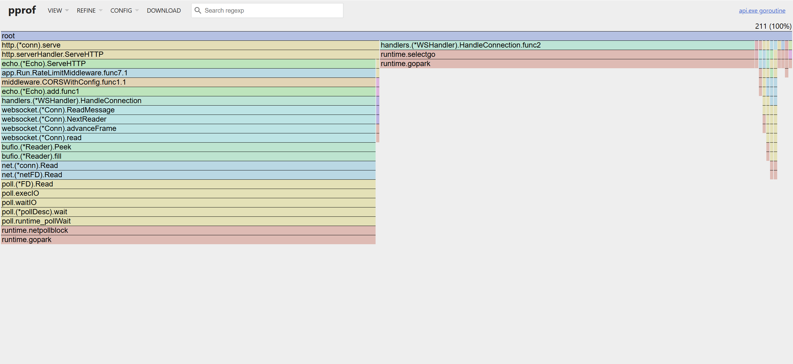
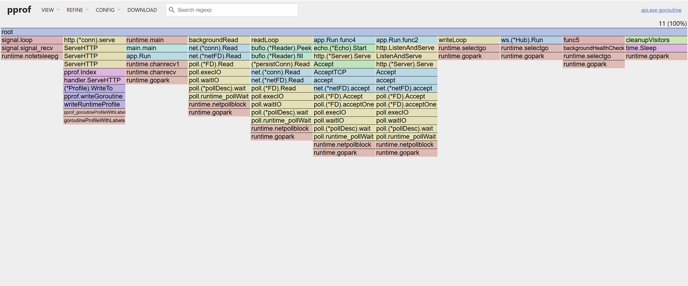

## Playingfield

[<image-card alt="CI" src="https://github.com/Nelfander/Playingfield/actions/workflows/ci.yml/badge.svg" ></image-card>](https://github.com/Nelfander/Playingfield/actions/workflows/ci.yml)

**Playingfield is a real-time, collaborative project and task management platform with live WebSocket sync, project-scoped chat, granular RBAC, file attachments, and structured domain logic — built for reliability and a production mindset, not just a demo app.**

Unlike typical boilerplate task boards, it combines:

- **Live, multi-user synchronization** via custom WebSocket hubs (no polling)
- **Project-level real-time chat**, automatically provisioned per project
- **Secure, token-based authentication** with strict ownership and permission checks
- **Kanban-style task boards** with persistent history and status tracking
- **Atomic file storage** backed by S3/MinIO with collision-proof asset naming
- **Type-safe backend** using Go + Echo + SQLC, designed for maintainability
- **Rate limiting & traffic resilience** built into the API layer
- **React + TypeScript frontend** with real-time UI updates powered by WebSockets
- **Structured logging** with Go slog, request-scoped fields, and centralized error handling
- **Custom HTTP error handler** for consistent API responses

---

## Who Is This For?

- Developers who want a **real-time collaborative board foundation** with production-grade patterns  
- Engineers exploring **Go-based backend architecture with structured domain separation**  
- Builders who care about **correctness, security boundaries, and real-time systems**  
- Anyone who wants a serious full-stack reference — not a tutorial toy  

---

## What Problems Does It Solve?

- Eliminates **eventual consistency lag** from polling-based UIs  
- Enables **real-time team communication scoped per project**
- Prevents **insecure file attachment handling** with atomic storage coordination  
- Enforces **clear ownership and permission boundaries** via RBAC  
- Avoids fragile, tightly-coupled backend logic through structured domain layers  
- Reduces type mismatches using **SQLC-generated, type-safe queries**

---

## What Makes It Different From Boilerplate Projects?

- Real WebSocket orchestration powering both board updates and chat
- Project-scoped chat automatically tied to membership boundaries
- Explicit RBAC and ownership enforcement at the API layer
- Atomic coordination between database records and object storage
- Clean separation of handlers, services, repositories, and domain logic
- Designed with extension and maintainability in mind

---

## 🌟 Key Features

### 💬 Real-Time Project Chat
* **Contextual Messaging:** Each project features a dedicated real-time chat room.
* **Smart UI Alignment:** Messages are intelligently aligned—your messages appear on the right ("Me") in blue, while teammates' messages appear on the left in gray.
* **Live Timestamps:** Every message is stamped with a human-readable time (e.g., 14:05) for better context.
* **History Persistence:** New members can see previous project discussions instantly upon joining.

### 📋 Collaborative Task Management
* **Kanban-Style Organization:** High-visibility board layout grouping tasks into `To Do`, `In Progress`, and `Done` columns for clear project tracking.
* **Granular Task Ownership:** Ability to create tasks with specific descriptions and assign them to any verified project member.
* **Integrated Document & Asset Management:** Engineered a robust integration with **MinIO**, utilizing a streaming `io.Reader` pattern to handle file uploads without memory-bloating the server.
* **UUID-Namespaced Assets:** Implemented automated collision-prevention by prefixing file names with unique UUIDs, allowing multiple users to upload identical filenames to the same task safely.
* **Strict "Collaborator-Only" Access:** Deployed a refined RBAC (Role-Based Access Control) layer where only the **Project Owner** or the **Task Assignee** can upload or delete attachments, while other project members maintain "Read-Only" gallery access.
* **Atomic Deletion Sync:** A precision-engineered cleanup flow that ensures physical files are purged from the storage bucket immediately before their metadata is removed from Postgres, preventing "storage leaks" and orphan data.
* **Signal-Driven Refresh:** Leverages a lightweight "Pulse" synchronization logic where task changes trigger instant UI re-validation across all collaborator screens via WebSockets.
* **Persistent History:** Every task is backed by a robust database schema, ensuring assignments and statuses are preserved across sessions. Every action—from status updates to file uploads—is recorded in a "Git-like" timeline so members can see what was changed, when, and by whom.

### ⚡ Real-Time Synchronization (WebSockets)
* **Global Hub:** A custom WebSocket Hub manages concurrent client connections and room-based broadcasting.
* **Live Dashboard Updates:** * **Project/Task Membership:** Projects/Tasks appear/vanish from your dashboard instantly when you are added or removed by an owner.
 * **Global Deletion/Creation:** If an owner creates/deletes/updates a project/task, it is edited from every member's screen in real-time.
* **Automatic Member Sync:** Live updates to member lists without requiring page refreshes.

### 🔐 Authentication & Security
* **JWT-Based Auth:** Secure registration and login with token-based identity.
* **Identity Integrity:** Handlers derive `user_id` exclusively from verified JWT claims, preventing "ID Spoofing."
* **Ownership Enforcement:** Destructive actions (deleting projects/tasks, removing members) are restricted to the project owner via backend middleware.
Updating or creating actions are the same.

### 🛡️ Resilience & Traffic Control
* **Tiered Rate Limiting (Token Bucket):** Implemented a high-performance middleware using `golang.org/x/time/rate`. It dynamically adjusts throughput based on identity:
    * **Anonymous Tier:** Strict IP-based limits (5 req/sec) to mitigate brute-force attacks and bot scraping.
    * **Authenticated Tier:** Upgraded "VIP" limits (20 req/sec) for registered users, ensuring a smooth experience for legitimate app usage.
* **Concurrency-First Registry:** Manages visitor state using a `sync.RWMutex` with a "Double-Checked Locking" pattern. This ensures the rate limiter never becomes a bottleneck during traffic spikes.
* **Automated Memory Reclamation:** A background "Janitor" goroutine monitors the visitor registry, automatically pruning inactive entries every 10 minutes to maintain a flat memory footprint.
* **Lazy JWT Verification:** Optimized middleware chain that "peeks" at the Authorization header to identify users, caching verified claims in the request context to avoid redundant cryptographic operations in downstream handlers.
* **CORS-Aware Throttling:** Optimized the middleware to recognize OPTIONS pre-flight signatures, preventing "False-Positive" rate-limiting of browser security handshakes.

### 🛠️ Reliability & Observability
* **Storage Provider Abstraction:** Abstracted storage logic into a `StorageProvider` interface, allowing the application to swap between local MinIO and AWS S3 with zero code changes in the domain layer.
* **Centralized Error Translation:** Implemented a Global Error Handler that acts as a bridge between internal domain errors and HTTP responses. It ensures that internal truths are logged for developers while users receive clean, safe, and actionable error messages.
* **Structured Telemetry (slog):** The system uses machine-readable JSON logging in production. It follows a "Leveled" approach where low-level database traces are hidden by default, and only actionable events trigger alerts.
* **Recursive Error Wrapping:** Using Go's `%w` verb to wrap errors as they move up the stack. This preserves the original error (like a DB connection timeout) while adding "Domain Context."
* **Defensive Mapping:** Data is strictly mapped between the Database (Postgres/sqlc) and the Domain (Go structs), ensuring database changes never break business rules.

---

## 🛠 Tech Stack
### Backend
- **Go (Echo framework)**
- **SQLC** (Type-safe SQL generation)
- **AWS SDK v2** (S3-compatible asset management)
- **Gorilla WebSocket** (Real-time project hubs)
- **JWT-based authentication**
- **Auth-aware rate limiting** (Tiered throttling)
- **Context-driven request lifecycle**
- **Structured logging & custom HTTP error handling**

### Storage & Database
- **PostgreSQL (Neon.tech)**: Transaction-safe schema & migrations.
- **MinIO**: S3-compatible object storage for task attachments.
- **Atomic File Logic**: Metadata in Postgres synced with physical blobs in S3.

### Frontend
- **React 18** (Functional components & Hooks)
- **TypeScript** (Strict type definitions)
- **Vite** (Next-gen frontend tooling)
- **CSS3** (Glassmorphism UI)

### Communication
- **REST API** for state management
- **WebSockets** for real-time updates

### Testing & Reliability
- **Domain-Driven Design (DDD)**: Clear separation between infrastructure and business logic.
- **Repository Pattern**: Using Fake Repositories for fast, isolated unit testing.
- **Race Detection (`-race`)**: Ensuring thread-safety in WebSocket hubs and rate limiters.
- **Structured Telemetry (slog)**: Machine-readable JSON logging for production observability.

### Infrastructure
- **Dockerized services** (Development parity)
- **AWS Deployment** (Planned)
---

## 🏛 Architectural Decisions 

Choosing the right stack was a balance between Go's high-performance concurrency and developer productivity.

#### 1. Backend: Echo Framework vs. Gin
* **Decision**: [Echo](https://echo.labstack.com/)
* **Reasoning**: Echo was selected for its superior performance benchmarks and built-in middleware capabilities (specifically for JWT and CORS). While Gin is a standard, Echo’s `Context` handling felt more idiomatic for this project's WebSocket hub orchestration. With that being said if I would do this project again I would totally do it with Gin Framework just to see the differences. At the time I started this project I was under the impresion that Echo is the Go-to!
* **Evaluation**: Post-implementation, Echo's centralized error handling proved highly effective for managing real-time stream failures.

#### 2. Schema Strategy: Why SQLC over raw `database/sql`?
* **Decision**: [sqlc](https://sqlc.dev/) for Type-Safe Queries
* **The "Why"**: A lot of people use heavy ORMs like GORM because they think it makes switching databases easy, but I think that in the real world you rarely switch your DB. What you *do* do is change your schema. I wanted a tool that would catch my mistakes early.
* **The Logic**: With sqlc, I write raw SQL for Postgres and it generates the Go code for me. If I change a column name in the DB but forget to update my queries, the code won't compile. It gives me the performance of raw SQL with the safety of a compiled language, so I don't have to worry about runtime "null pointer" crashes when fetching project data.

#### 3. State Management: React Hooks + WebSockets
* **Decision**: Encapsulated Hook Pattern (`useDirectChat`)
* **Reasoning**: Instead of a global store (Redux), I opted for localized state management via custom hooks. This ensures that WebSocket subscriptions are lifecycle-aware; when a user leaves a chat component, the connection is cleaned up immediately, preventing goroutine leaks on the Go backend.

#### 4. File Storage: Why MinIO (S3) instead of just the DB?
* **Decision**: [MinIO](https://min.io/)
* **The "Why"**: I didn't want to bloat my Postgres database with binary file data (BLOBs), which makes backups a nightmare and slows down queries. I went with MinIO because it’s S3-compatible. This way, when I move the app to AWS, I can just point the config to an S3 bucket and the code won't change.
* **The Logic**: The backend acts as a gatekeeper. Instead of making files public, the Go API checks if you're authorized and then streams the file from MinIO to you. It keeps the data secure without exposing my storage server to the internet.

#### 5. High-Frequency Counting: Atomics over Mutex
* **Decision**: `sync/atomic` for the Rate Limiter
* **The "Why"**: Initially, I thought about using a Mutex to lock the rate-limiter count, but Mutexes are heavy because they make other threads wait in line. Since the rate-limiter runs on every single request, I wanted it to be as "invisible" as possible.
* **The Logic**: I used Atomic Compare-And-Swap (CAS). It handles the math at the CPU hardware level. It's non-blocking, meaning the WebSocket hub can keep pushing messages without getting stuck behind a database lock or a slow middleware check.

#### 6. Real-Time: WebSockets vs. HTTP Polling
* **Decision**: Bidirectional WebSockets
* **The "Why"**: For a chat and task board, I wanted updates to be instant. Refreshing every 5 seconds (polling) felt "laggy" and wastes a lot of bandwidth on headers. 
* **The Logic**: I built a Hub/Client pattern in Go. The biggest challenge here wasn't sending messages, but managing the "state" of the connection—making sure that when a user closes their browser, the server cleans up the goroutine so I don't leak memory. It makes the UI feel snappy, like a real desktop app.

#### 7. Project Isolation: Why a Centralized Hub?
* **Decision**: Single-Hub Multiplexing
* **The "Why"**: I had to decide between creating a new "room" for every project or having one central Hub that handles everything. I went with a centralized Hub because it simplifies the WebSocket lifecycle. 
* **The Logic**: The Hub maintains a map of project IDs to sets of clients. Instead of a user having 10 different socket connections for 10 projects, they have one persistent connection, and the backend "routes" the messages based on the `project_id` in the JSON payload. It’s much lighter on the server's file descriptors.

#### 8. Ephemeral State: Typing Indicators & Redis
* **Decision**: In-Memory Status (vs. Database updates)
* **The "Why"**: "Typing..." status changes every second. If I saved that to Postgres, the database would be crushed by useless writes. 
* **The Logic**: I treat typing indicators as "fire-and-forget" events. The server broadcasts them immediately to other members of the project but never touches the disk. For the portfolio, I implemented this in-memory, but I designed the Hub so I could easily swap in **Redis Pub/Sub** if I ever need to scale this across multiple server instances.

#### 9. Pattern: Monolithic Evolution
* **Decision**: Single Project Monolith
* **The "Why"**: This project began as a focused exercise to learn Go's fundamentals. As I grew more comfortable with the language, I began adding new features that I learned that exist and sounded cool to me  (like WebSockets and S3 storage). 
* **The Logic**: While I considered breaking these into microservices, I decided to keep the architecture monolithic. This allowed me to focus on learning Go's concurrency and internal package structures without the "network tax" and operational overhead of managing multiple independent services.
* **Future-Proofing**: Because the code is organized into clean internal packages (Auth, Chat, Projects), the boundaries are already defined. If I needed to scale the Chat Hub independently on AWS in the future, it is already "seamed" for a clean break into a microservice.

#### 10. Deployment: Containerized Environment  (TO-DO)
* **Decision**: Docker-Compose Orchestration
* **The "Why"**: I want a "one-command" setup. I dont want anyone to struggle with installing Postgres versions or configuring MinIO buckets manually. 
* **The Logic**: By splitting the project into four containers (Frontend, Backend, DB, Storage), I create a modular environment. This makes the app "Infrastructure Agnostic"—I can run it on my local laptop, a Raspberry Pi, or scale it up to AWS ECS without changing a single line of application code.

#### 11. Database Infrastructure: Neon (Serverless Postgres)
* **Decision**: [Neon](https://neon.tech/)
* **The "Why"**: I chose Neon over a standard self-hosted Postgres instance to leverage its serverless architecture. This allows for instant database branching—meaning I can create a copy of my production data for testing without any downtime or manual exports.
* **The Logic**: Neon’s built-in connection pooling (via PgBouncer) is a perfect match for a Go backend. Since Go's `database/sql` opens multiple connections under high load, Neon ensures the database doesn't hit its connection limit, maintaining stability even during high-frequency WebSocket traffic.

---
## 📡 WebSocket Architecture & Concurrency

This project implements a high-performance, thread-safe WebSocket system designed to handle thousands of concurrent users across multiple project "rooms."

### 🔧 Key Technical Features

* **Goroutine Lifecycle Management:** Each connection is managed by two dedicated goroutines: a `ReadPump` for incoming messages and a `WritePump` for outgoing data.
* **Heartbeat (Ping/Pong):** Uses an aggressive heartbeat mechanism to detect "half-open" TCP connections and clean up zombie goroutines within 10-30 seconds.
* **Atomic Cleanup:** Utilizes `sync.Once` to ensure that connection closure and hub unregistration happen exactly once, preventing race conditions or double-close panics.
* **Non-Blocking Hub:** The Hub uses buffered channels and `select` statements to ensure that slow clients or a busy Hub never block the main HTTP handlers.


### ⚙️ Connection Timing Constants

To balance server resources with user experience, we utilize a "sliding window" timeout strategy:

| Constant | Value | Description |
| :--- | :--- | :--- |
| `writeWait` | **10s** | Time allowed to write a message to the peer before timing out. |
| `pongWait` | **30s** | Max time allowed to read the next pong from the peer. |
| `pingPeriod` | **25s** | Interval between pings (must be less than `pongWait`). |

### 🛠 The "Master Kill Switch" Pattern
We use a centralized `cleanup()` function to guarantee resource release. This ensures that even if a client script crashes or the network fails silently, the server resources are reclaimed:

```go
cleanup := func() {
    once.Do(func() {
        // Force the ReadMessage to return an error immediately
        conn.SetReadDeadline(time.Now()) 
        conn.Close() 
        
        // Signal the Hub to unregister, but don't block if the Hub is busy
        select {
        case h.hub.Unregister <- client:
        default:
        }
    })
}
```

### 📊 Performance & Stress Testing (Verified via pprof)

To ensure the system remains stable under high load, the WebSocket implementation was subjected to stress testing using a custom PowerShell script to simulate rapid connection bursts.

#### Test Scenario:
1. **Baseline:** Server idling at **11** goroutines.
2. **The Burst:** **100 concurrent clients** established connections within 1 second.
3. **The Peak:** Total goroutine count reached **211** (1 Hub loop + 10 baseline + 200 per-client pumps).
4. **The "Hard" Disconnect:** The client script was terminated abruptly to simulate a network crash or client-side failure.

> [!IMPORTANT]
> **Rate Limiter Configuration for Testing:** > If you are running the stress test script, ensure you temporarily increase the `RateLimiter` threshold in the middleware. By default, the system protects against rapid bursts; to simulate 100+ concurrent connections from a single IP, the limit must be adjusted or bypassed for the test machine.

#### 🛠 Reproducing the Test
To verify the goroutine cleanup logic, you can use the following PowerShell script. This simulates 100 concurrent clients connecting, holding the connection, and then abruptly terminating.

<details>
<summary><b>Click to view PowerShell Stress Test Script</b></summary>

```powershell
# websocket_stress_test.ps1
$url = "ws://localhost:880/ws?token=YOUR_TEST_TOKEN&projectId=1"
$connectionCount = 100
$jobs = @()

Write-Host "🚀 Spawning $connectionCount concurrent WebSocket clients..." -ForegroundColor Cyan

for ($i = 1; $i -le $connectionCount; $i++) {
    $jobs += Start-Job -ScriptBlock {
        param($url)
        try {
            $ws = New-Object ClientWebSocket
            $ct = New-Object System.Threading.CancellationTokenSource
            $task = $ws.ConnectAsync($url, $ct.Token)
            $task.Wait()
            
            # Keep connection open for 15 seconds
            Start-Sleep -Seconds 15
            $ws.Dispose()
        } catch {
            # Silent fail for stress test
        }
    } -ArgumentList $url
}

Write-Host "✅ All clients connected. Waiting 15s..." -ForegroundColor Green
Start-Sleep -Seconds 15

Write-Host "🛑 Terminating all clients abruptly..." -ForegroundColor Yellow
$jobs | Stop-Job
$jobs | Remove-Job

Write-Host "🏁 Test complete. Check pprof for goroutine drop." -ForegroundColor Cyan
```
</details>

#### Results:
* **Detection:** The server successfully detected the "half-open" connections via the `writeWait` timeout and `pingPeriod` cycle.
* **Cleanup:** All **200** client-related goroutines were destroyed, and the client was unregistered from the Hub within **10–20 seconds**.
* **Recovery:** The system returned to its original baseline (**9–11** goroutines) without any memory leaks or orphaned routines.


| Metric | Start | Peak | Post-Cleanup |
| :--- | :--- | :--- | :--- |
| **Goroutines** | 11 | 211 | 11 |
| **Active Sockets** | 1 | 101 | 1 |
| **Hub Congestion** | 0% | < 1% | 0% |

> **Note:** The drop to 9 goroutines (below the 11 baseline) indicates that the "Master Kill Switch" logic successfully cleaned up pre-existing "zombie" connections that were lingering from previous sessions.

#### 📈 pprof Visualization
<details>
<summary><b>Click to view pprof Visualization</b></summary>
The following snapshots verify the goroutine lifecycle and resource reclamation:


*Figure 1: pprof at peak load (211 goroutines) during active 100-user burst.*


*Figure 2: pprof post-cleanup (11 goroutines) demonstrating zero leaked routines.*
</details>

## 📡 WebSocket Flow
<details>
<summary><b>System Orchestration Detail</b> (Click to expand)</summary>

1. **Handshake & Upgrade**: The handler validates the JWT, upgrades the HTTP connection, and configures the underlying `net.TCPConn` with **TCP Keep-Alives** (30s) to detect hardware-level silent failures.
2. **Registration & Initialization**: A `Client` object is instantiated and dispatched to the `Hub` via the `Register` channel. A **Unified Cleanup** closure is initialized using `sync.Once` to prevent teardown race conditions.
3. **Dual-Pump Concurrency**: 
    * **WritePump (Goroutine)**: Handles the outgoing message queue and the **25s Heartbeat (Ping)**. It enforces a 10s `writeWait` to ensure the server doesn't hang on stalled client buffers.
    * **ReadPump (Main Loop)**: Processes incoming frames and pongs, continuously resetting the **30s ReadDeadline** to verify client liveness.
4. **Hub Orchestration**: The Hub routes payloads to specific Project Rooms or Users. All outbound signals to the `Client.Send` channel are wrapped in `select` blocks to prevent a single slow peer from creating backpressure on the entire Hub.
5. **Atomic Teardown**: Upon any failure or timeout, the **Master Kill Switch** is triggered. It forces an immediate socket closure and an asynchronous `Unregister` signal, ensuring the goroutine stack returns to baseline (9-11) within seconds.

</details>

---

## Future Goals
* Implement **Task creation from the UI**. ✅
* Improve **error handling and logging** further. ✅
* Implement **user role management** (admin vs regular users). ✅ 
* Add **unit and integration tests** for the project domain.  ✅
* Add **Project group chats and 1 on 1 individual project member chat feature**. ✅
* Implement **File Upload Feature**. ✅
* Implement **The Redis Route (Distributed State)**. Not sure yet (if scaled maybe!)
* Dockerize **Containerize**.
* Deploy **AWS Deployment**.

---


## 🚀 Quick Start
<details>
<summary><b>Quick Start!</b> (Click to expand)</summary>

Configuration is loaded from .env (example provided) or OS environment variables.
No secrets are committed to the repository.
Assuming you have Docker, Go 1.25+ (tested on 1.25.5), Node.js/npm installed:

### 1. Repository & Infrastructure
Clone the project and spin up the supporting services (PostgreSQL & MinIO):

   git clone https://github.com/Nelfander/Playingfield.git
   cd Playingfield
   docker-compose up -d

### 2. Backend Setup
Configure your .env file, generate code, and launch the Go server:

   Update .env with DB and MinIO credentials

   sqlc generate

   go run ./cmd/server

### 3. Frontend Setup
In a new terminal, install dependencies and start the application:

   cd frontend

   npm install

   npm start

### 4. Testing the API (via PowerShell, curl, or Postman)

The frontend is mainly for visual demo — use these examples to test some of the core endpoints:

  ```powershell
  # 1. Login and get JWT token
  $login = Invoke-RestMethod -Method POST -Uri http://localhost:880/login -ContentType "application/json" -Body '{"email":"me@example.com","password":"supersecret"}'
  $token = $login.token

  # 2. Create a project
  Invoke-RestMethod -Method POST -Uri http://localhost:880/projects -Headers @{ Authorization = "Bearer $token" } -ContentType "application/json" -Body '{"name":"Ball","description":"First Ball project"}'

  # 3. List your projects
  Invoke-RestMethod -Method GET -Uri http://localhost:880/projects -Headers @{ Authorization = "Bearer $token" }

  # 4. Upload a file attachment to a task (example with curl)
  $filePath = "C:\path\to\your\test-file.png"
  curl -X POST "http://localhost:880/tasks/1/attachments" \
  -H "Authorization: Bearer $token" \
  -F "file=@/path/to/your/test-file"
  ```

  </details>

  ---


## 🧪 Testing 

The project employs a tiered testing strategy using Go's native toolchain and the `testify/assert` library. By utilizing **Stateful Fake Repositories**, the suite ensures high execution speed and 100% data consistency without the overhead of a live database.

---

### 🏎️ Concurrency & Race Safety
The entire suite is verified using the **Go Race Detector** to ensure thread-safety in high-concurrency environments (like WebSockets).

* **CGO Enabled:** Configured with MinGW-w64 to support runtime memory analysis.
* **Thread-Safe Fakes:** Repositories utilize `sync.RWMutex` to prevent data races during parallel test execution.
* **Verification:** Run the full race-detection suite with:
  ```bash
  $env:CGO_ENABLED = "1"; go test -race ./...

---


### 🧩 Domain & Unit Testing (Logic Layer)
These tests focus on core business rules in isolation. They sit within the domain packages to verify that the "brain" of the application works correctly.

<details>
<summary><b>👤 User Identity & Lifecycle</b></summary>

Validated within `internal/domain/user/`.

* **Registration & Auth Flow**: Verifies successful user onboarding with default roles (`user`) and status (`active`), while ensuring **Duplicate Email** prevention via sentinel errors.
* **Security & Persistence**:
    * **State-Aware Login**: Validates that authentication respects account states (e.g., preventing **Inactive** or **Scrubbed** accounts from accessing the system).
    * **Credential Integrity**: Ensures password hashing/comparison logic (via Bcrypt) is correctly integrated with the service layer.
* **Administrative Identity Scrubbing (Soft-Purge)**:
    * **PII Anonymization**: Confirms that scrubbing masks emails (e.g., `deleted_1@...`) and purges password hashes to "SCRUBBED" while maintaining the database record for historical integrity.
    * **Self-Preservation Logic**: A critical safety test ensuring that Administrators cannot accidentally scrub their own accounts.
    * **Visibility Filtering**: Verifies that once a user is scrubbed, they are automatically excluded from global active user lists, effectively "evicting" them from the platform UI.
* **Execution**: `go test -v ./internal/domain/user`
</details>

<details>
<summary><b>💬 Messaging & Authorization Logic</b></summary>

Validated within `internal/domain/messages/`.

* **Logic Gates:** Verifies that project messages are only accepted from verified members.
* **Social Constraints:** Ensures Direct Messages (DMs) are restricted to users who share at least one project.
* **Stateful Persistence:** Uses a `FakeRepository` to simulate message storage and chronological retrieval.
* **Nil-Resilience:** Validates that service methods handle infrastructure (WebSocket Hub) availability gracefully.
* **Execution:** `go test -v ./internal/domain/messages`
</details>

<details>
<summary><b>🏗️ Project Lifecycle & Ownership</b></summary>

Validated within `internal/domain/projects/`.

* **Ownership Guardrails:** Ensures only the project creator can delete resources or manage members.
* **Auto-Provisioning:** Validates that the system correctly assigns roles upon project creation.
* **Service-Based Seeding:** Uses the Service layer in tests to ensure realistic system states (e.g., owners are automatically members).
* **Member Management:** Tests the "Join Table" logic in-memory to ensure member lists are accurate.
* **Execution:** `go test -v ./internal/domain/projects`
</details>

<details>
<summary><b>📋 Task Management & Cross-Domain Security</b></summary>

Validated within `internal/domain/tasks/`.

* **Multi-Role Authorization:** Verifies the "VIP lanes" for updates—ensuring only Project Owners OR the specific Task Assignee can modify status.
* **Audit Trails:** Validates that every task action (Create/Update) automatically triggers a `TaskActivity` log entry.
* **Cross-Domain Integrity:** Tests the service's ability to verify project-level permissions before performing task-level actions.
* **Context Respect:** Ensures all repository methods correctly honor context deadlines and cancellations.
* **Execution:** `go test -v ./internal/domain/tasks`
</details>

---

### 🌐 HTTP & Integration Testing (API Layer)

These tests verify the "Social" integration between the HTTP layer, Middleware, and the Service layer.

<details>
<summary><b>🔐 Middleware & Security</b></summary>

Validated within `internal/interfaces/http/middleware/`.

* **JWT Integrity:** Ensures `JWTMiddleware` correctly extracts and validates tokens from headers.
* **Context Injection:** Verifies that user identity (ID, Role) is correctly passed to the internal logic.
* **RBAC Enforcement:** Specifically validates the `RequireRole("admin")` guard, ensuring that high-privilege operations like "Identity Scrubbing" are strictly restricted to system administrators.
* **Execution:** `go test -v ./internal/interfaces/http/middleware/...`
</details>

<details>
<summary><b>🚀 API Handler Endpoints & Error Translation</b></summary>

Validated within `internal/interfaces/http/tests/`.

* **Centralized Error Mapping:** Verifies that Domain Sentinel errors (like `ErrUnauthorized`) are correctly translated into standard HTTP codes (403, 404, 409).
* **End-to-End Persistence:** Tests the full flow from an HTTP request through the Service layer into the Fake Repository.
* **Security Resilience:** Tests that unauthorized API attempts return clean, safe error messages without leaking system internals.
* **Cross-Domain Cleanup:** Validates the "Ripple Effect" of a User Scrub. This test ensures that when the User Service triggers a scrub, the system successfully:
    1.  **Evicts** the user from all project memberships.
    2.  **Unlinks** the user from all active task assignments.
* **JSON Binding:** Validates strict structural binding for complex entities like Tasks and Projects.
* **Execution:** `go test -v ./internal/interfaces/http/tests/...`
</details>

---

### ⚡ Real-Time Integration (WebSocket)
Testing for the communication engine, verifying that messages are not only saved but correctly routed.

<details>
<summary><b>📡 Full-Circuit Broadcast Integration</b></summary>

Validated through service-to-hub integration tests.

* **Live Signal Chain:** Proves the "Whole Circuit"—from a Service action (creating a task) through the Hub's concurrency loop to a Client's receiver channel.
* **Concurrency Safety:** Validates the Hub’s `sync.RWMutex` logic under simulated client registrations and broadcasts.
* **Room-Based Isolation:** Ensures the Hub correctly manages `ProjectRooms` for targeted data delivery.
* **Execution:** `go test -v ./internal/domain/tasks -run TestTaskService_WebSocketIntegration` , `go test -v ./internal/domain/tasks -run TestTaskService_WebSocketBroadcast`
</details>

<details>
<summary><b>📡 WebSocket Hub & Chat Tester</b></summary>

* **Connection Mapping:** Verifies the `Hub` correctly maps User IDs to active WebSocket connections.
* **Targeted Broadcasting:** Validates that messages sent to a project are routed strictly to that project's members.
* **Direct Messaging (P2P):** Ensures private messages are routed strictly to the sender and receiver.
* **E2E Script:** A dedicated utility (`scripts/test_chat.go`) to verify the full "Plumbing" from Auth -> Upgrade -> Broadcast.
* **Execution:** `go run scripts/test_chat.go`
</details>

---

## Known Issues & How I Solved Them
<details>
<summary>(Click to expand)</summary>

### 1. Users created with empty role/status

* Issue: Old rows in Neon/PostgreSQL had `role=""` and `status=NULL`, breaking login and JWT logic.
* Solution:

  * Set **default values in DB**: `role TEXT NOT NULL DEFAULT 'user'`, `status TEXT NOT NULL DEFAULT 'active'`.
  * Updated **SQLC `CreateUser` query** to include `role` and `status`.
  * Updated Go repository to explicitly set `Role` and `Status` during user creation.
  * Re-registered users to clean the broken rows.

### 2. Project creation owned by the wrong user

* Issue: `owner_id` was sometimes taken from request instead of JWT, causing `0` or incorrect IDs.
* Solution:

  * Handlers now derive `owner_id` **exclusively from JWT claims**.
  * Both **CreateProject** and **ListProjects** enforce this invariant.
  * Removed `OwnerID` from client request structs.

### 3. Duplicate project names

* Issue: Initially, there was no constraint enforcing per-user uniqueness. Users could create multiple projects with the same name.
* Solution:

  * Added **database unique constraint** on `(owner_id, name)`.
  * Handled `duplicate key` errors in the `CreateProject` handler, returning `409 Conflict` with JSON error.
  * PowerShell commands now show a friendly error message instead of a generic 500.

### 4. Generic Internal Server Errors in PowerShell

* Issue: PowerShell throws `Invoke-RestMethod : 500 Internal Server Error` for any failed request.
* Solution:

  * Added **debug logging** in handlers to print real errors to server console.
  * Ensured handler returns **specific HTTP status codes** (`400`, `401`, `409`) with JSON error bodies.
  
### 5. The "Vanishing List" Bug
* **Issue:** WebSocket updates triggered a UI toggle, closing the project list.
* **Solution:** Separated fetchProjects logic from the showProjects toggle state, allowing background refreshes without affecting UI visibility.

### 6. The "Room 0" Connection Spam
* **Issue:** Components re-rendering caused the WebSocket hook to reconnect multiple times, flooding the server with "User joined Room 0" warnings.
* **Solution:** Implemented `useRef` to maintain a stable socket connection and a **cleanup function** to close old sockets before new ones open. Added a "connection lock" to prevent React Strict Mode from double-connecting.

### 7. The "Null Map" Crash
* **Issue:** Fetching chat history for a brand-new project returned `null`, causing the frontend `.map()` function to crash the app.
* **Solution:** Implemented "Guard Clauses" in the frontend (`history || []`) and ensured the Go backend initializes empty slices instead of returning nil.

### 8. Testing really helps =D
* **Issue**: While writing automated tests for "Unauthorized Access," I discovered a security vulnerability. The system allowed *any* logged-in user to add members to *any* project because the service lacked ownership context.
* **Solution**: 
    * Updated the Service signature to accept a `requesterID`.
    * Implemented **Object-Level Authorization**: The service now fetches the project and compares the `OwnerID` against the `requesterID` before performing any mutations.
    * Fixed a "Silent Bug" regarding parameter ordering (`userID` vs `projectID`) identified during unit testing.

### 9. Race Conditions on `client.Send`
* **Issue**: The hub was closing `client.Send` directly during `Unregister`, while the handler’s writer goroutine could still be sending, causing potential `panic: send on closed channel`.  
* **Solution**:  
    * Introduced a `done` channel owned by `Client`.  
    * Writer goroutine now listens on `done` and closes `Send` itself.  
    * Hub signals shutdown by closing `done` instead of `Send`.  
    * Encapsulation maintained by keeping `done` unexported and exposing only a getter method.

### 10. Handler Owning Connection Logic
* **Issue**: The handler managed both reading from the websocket and writing to it, forcing export of internal channels and complicating lifecycle management.  
* **Solution**:  
    * Writer goroutine remains in the handler for now, handling writes safely via the `done` channel.  
    * Handler upgrades the connection, creates the client, registers it with the hub, and starts the writer.  
    * Lifecycle management and connection cleanup are coordinated with the hub and `done` signaling.

### 11. Hub Coupled to Transport
* **Issue**: The hub contained logic that could block or panic when writing to clients directly. It also tracked websocket details unnecessarily.  
* **Solution**:  
    * Hub now only routes messages, adds/removes clients from rooms, and signals shutdown.  
    * Writes are fully handled by the handler’s writer goroutine; the hub uses non-blocking sends to prevent backpressure issues.  

### 12. Unsafe Channel Access Across Packages
* **Issue**: Accessing `done` directly from the handler required exporting the channel, which could allow accidental closure from external code.  
* **Solution**:  
    * Added `Client.DoneChan()` getter, providing read-only access for select statements in the handler.  
    * Maintained internal ownership, ensuring only the writer closes channels and prevents panics.  

### 13. Zombie Connection Purge & Half-Open TCP Resilience
* **Issue**: The server-side `ReadPump` was blocking indefinitely on `ReadMessage()` due to "half-open" TCP states. Because the test script terminated processes without sending proper WebSocket `Close` frames, the backend held 100+ "zombie" goroutines that never received a network-level hang-up signal.
* **Solution**:
    * **The `SetReadDeadline` Tripwire**: Implemented a sliding-window heartbeat. By calling `conn.SetReadDeadline(time.Now().Add(pongWait))` on every successful pong, the system now forces a hard-error in the `ReadPump` if the client remains silent for >30s, effectively self-destructing dead routines.
    * **Atomic `sync.Once` Cleanup**: Encapsulated socket closure and Hub unregistration within a `sync.Once` block. This guarantees that whether the failure originates in the `ReadPump` or `WritePump`, the resource release is executed exactly once, preventing "Close on Closed Channel" panics.

</details>

---

## 🛠 <b>Development History</b>
<details><summary>(Click to expand)</summary>

<details>
<summary><b>Feb 19, 2026: Identity Scrubbing Resilience & Permission-Aware Task State</b> (Click to expand) </summary>

### Phase 1: Identity Scrubbing & Persistence Stability
* **Scrub Test Validation**: Successfully verified the "Deleted User" lifecycle; when a user is scrubbed, their owned projects are purged via cascading logic, while their activity in shared projects persists as an anonymized historical record.
* **Audit Continuity**: Hardened the task history service to handle missing foreign keys. By finding and mapping user IDs to a validated member list, the system now gracefully displays "(deleted)" or "Unassigned" for scrubbed identities instead of returning 404/null errors.

### Phase 2: Role-Based Logic Hardening
* **Owner-Locked Assignment**: Restricted the `assigned_to` update authority to the Project Owner within the task persistence layer. This prevents non-owners from re-assigning work, ensuring the project hierarchy remains immutable during task transitions.
* **Assignee Operation Scoping**: Refactored the update payload to distinguish between "Status Updates" (allowed for assignees) and "Identity Updates" (restricted to owners), preventing unauthorized privilege escalation via API manipulation.

### Phase 3: Relational Integrity & Membership Decoupling
* **Member-Only Constraint**: Enforced a strict validation check ensuring only active project members can be linked to tasks. This prevents the "Global User Leak" where any system user could previously be assigned to a private project task.
* **Cascading Project Purge**: Refined the cleanup routine to ensure that when a primary identity is removed, all associated project ownerships are terminated immediately, preventing the existence of "orphaned" or "ghost" projects in the registry.

### Phase 4: Payload Normalization
* **Safe-Null Handling**: Updated the task model to handle `NULL` assignments safely across both the Go backend and React frontend. This ensures that unassigned tasks—common after a user scrub—do not break UI rendering or JSON serialization.
* **History Mapping**: Standardized the activity log formatter to dynamically map user IDs to emails from the current member pool, providing a fallback for deleted users without requiring expensive database joins on every fetch.
</details>

<details>
<summary><b>Feb 18, 2026: Persistence-First Identity Scrubbing & Transactional Integrity</b> (Click to expand) </summary>

### Phase 1: Transactional "Soft-Purge" Architecture
* **Atomic Scrubbing Routine**: Engineered a multi-stage PostgreSQL transaction within the `UserRepository` to handle user removal without breaking data integrity. The routine successfully unlinks users from active project memberships and task assignments while preserving the primary user record for historical audit logs.
* **Nullable Assignment Handling**: Implemented `pgtype.Int8` logic in the persistence layer to safely transition task assignments from a specific user ID to `NULL`. This ensures that historical tasks remain in the system as "unassigned" rather than being deleted alongside the user.

### Phase 2: Relational Cleanup & Ownership Transfers
* **Cascading Project Purge**: Hardened the `DeleteProjectsByOwner` routine to ensure that when an identity is scrubbed, any orphaned projects owned by that user are terminated. This prevents "ghost projects" from cluttering the global registry while keeping the database state synchronized.
* **Membership Decoupling**: Refactored the `RemoveUserFromAllProjectMemberships` query to surgically remove a user’s access rights across the platform. This ensures that a scrubbed user is immediately evicted from all UI views (like "Show Members") without requiring a manual cache clear.

### Phase 3: Identity Masking for History Persistence
* **Post-Scrub Identity Obfuscation**: Updated the `ScrubUserAccount` service to overwrite sensitive PII (emails and usernames) with anonymized placeholders (e.g., `deleted_user_ID@...`). This satisfies the requirement for history to persist while ensuring the user can no longer be contacted or identified.
* **Audit-Log Continuity**: Verified that foreign key constraints in history-tracking tables (like `task_history`) remain intact post-scrub. By keeping the user ID row present but "scrubbed," the backend ensures that historical logs ("User X changed status to Done") do not return 404 errors.

### Phase 4: API Normalization & Resilience
* **Case-Insensitive Payload Mapping**: Standardized the Go-to-JSON serialization to handle inconsistencies between `ID`/`id` and `Email`/`email` fields. This ensures that frontend components fetching global user lists receive a predictable data structure regardless of the underlying SQL row mapping.
* **Error Propagation Hardening**: Refactored database connection error handling to provide clearer logging when external poolers (like Neon) experience DNS resolution or suspension issues, preventing silent failures during administrative operations.
</details>

<details>
<summary><b>Feb 17, 2026: Admin Authorization Guardrails & Identity Scrubbing Infrastructure</b> (Click to expand) </summary>

### Phase 1: Role-Based Access Control (RBAC) Hardening
* **JWT Claims Integration**: Leveraged the `auth.Claims` structure to implement a server-side role verification layer. By injecting role metadata into the JWT, the backend now distinguishes between `member` and `admin` scopes during the middleware handshake.
* **Middleware Gatekeeping**: Deployed the `RequireRole("admin")` interceptor across the newly architected `adminGroup`. This ensures that unauthorized attempts to access system-wide user data are terminated at the routing level with a `403 Forbidden` or `401 Unauthorized` before reaching the business logic.

### Phase 2: Administrative Identity Orchestration
* **Atomic User Scrubbing**: Implemented a "Scrub Identity" routine within the `UserHandler` and `Service` layers. This function initiates a permanent purge of user records via `AdminScrubUser`, designed to clear the identity from the primary `users` table while triggering secondary cleanup tasks.
* **Global Visibility Hooks**: Engineered the `ListAllUsers` service method to bypass standard ownership filters. Unlike the standard `List` handler which relies on `claims.UserID` to scope results, this admin-specific path provides a "God-mode" view of the entire identity database for platform moderation.

### Phase 3: Defensive Data Mapping & Serialization
* **JSON Case-Resilience**: Optimized the API response handling to account for naming mismatches between Go's exported struct fields and the React frontend. By employing nullish coalescing logic and defensive serialization, the system ensures `id` and `email` fields are mapped correctly regardless of uppercase/lowercase JSON keying.
* **Input Sanitization**: Hardened the `ScrubUser` handler by enforcing strict `strconv.ParseInt` validation on URI parameters. This prevents injection attempts or malformed ID strings from reaching the persistence layer, returning a structured `400 Bad Request` on invalid input.

### Phase 4: Route Lifecycle & Environment Validation
* **Admin Group Isolation**: Refactored the `main.go` router to utilize Echo's `Group` functionality for administrative tasks. This logical separation isolates moderation routes (`/admin/users`) from standard authenticated routes, simplifying future security audits and logging.
* **Graceful State Persistence**: Verified that all administrative deletions are handled through the `postgres.NewUserRepository` using context-aware queries. This ensures that even high-privilege operations respect the system's 10-second shutdown deadline and signal handling.
</details>

<details>
<summary><b>Feb 16, 2026: Half-Open TCP Resilience & Unified Cleanup Architecture</b> (Click to expand) </summary>

### Phase 1: Aggressive Zombie Detection (Heartbeat Tuning)
* **Sliding-Window Deadlines**: Optimized the WebSocket heartbeat by synchronizing `pongWait` (30s) and `pingPeriod` (25s). This ensures that any "zombie" connection—resulting from ungraceful client termination or silent network failure—is detected and purged within a 30-second window, maintaining a lean goroutine footprint.
* **TCP-Level Keep-Alives**: Injected raw socket configurations into the upgraded connection via `net.TCPConn`. By enabling OS-level keep-alive probes with a 30s period, the system now forces the network stack to verify the peer's availability even if the application-level `ReadMessage` call is idling.

### Phase 2: Unified "Master Kill Switch" (Cleanup Logic)
* **Idempotent Resource Release**: Architected a unified `cleanup()` closure utilizing `sync.Once`. This pattern guarantees that socket closure, deadline termination, and Hub unregistration are executed exactly once, regardless of whether the failure originated in the `ReadPump` or the `WritePump`, effectively eliminating "Double-Close" panics.
* **Force-Exit Deadlines**: Implemented immediate deadline expiration (`SetReadDeadline(time.Now())`) within the cleanup cycle. This forces blocked syscalls to return an error instantly, ensuring that goroutines are released to the Go scheduler immediately rather than waiting for natural timeout expiration.

### Phase 3: Non-Blocking Hub Orchestration
* **Backpressure Mitigation**: Refactored the `Unregister` and `Error` signal paths to utilize `select` statements with `default` fallthroughs. This ensures that a saturated Hub or a stalled broadcast loop cannot "hold hostage" the HTTP handler goroutines, maintaining system-wide responsiveness during high-churn events.
* **Atomic Connection Registration**: Ensured that the `defer cleanup()` is scheduled only after a successful Hub registration. This prevents edge-case leaks where a failed registration could lead to orphaned routines that never receive a teardown signal.

### Phase 4: High-Concurrency Stress Testing
* **Burst Load Validation**: Conducted a controlled stress test simulating a 100-user connection burst. Utilized `pprof` to monitor the goroutine stack, successfully verifying a 100% cleanup rate. 
* **Recovery Profiling**: Confirmed the system returns to its baseline (9-11 goroutines) within 10-20 seconds of a massive "hard disconnect" event. This validates the efficiency of the `writeWait` timeout (10s) as a secondary detection mechanism for dead sockets.
</details>

<details>
<summary><b>Feb 15, 2026: Multi-Session Socket Multiplexing & Observability</b> (Click to expand) </summary>

### Phase 1: High-Availability Multi-Session Architecture
* **1-to-Many Connection Mapping**: Refactored the `Hub` data structure from a flat `map[int64]*Client` to a nested `map[int64]map[*Client]bool` architecture. This enables "Multi-Tab Synchronization," allowing a single `UserID` to maintain multiple concurrent WebSocket sessions (e.g., Desktop, Mobile, and multiple browser tabs) without session overriding.
* **Granular Lifecycle Orchestration**: Optimized the `Unregister` workflow to be session-aware. The system now utilizes a "Last-Tab-Out" logic, where the global `UserID` key is only purged from the Hub once the final active connection for that user is terminated, preventing premature state deletion during multi-window usage.

### Phase 2: Hub Concurrency & Broadcast Optimization
* **Nested Loop Propagation**: Updated `SendToUser` and `SendToProjectMembers` to iterate through connection buckets. This ensures that every active socket belonging to a user receives real-time updates simultaneously, maintaining state parity across all open client interfaces.
* **Thread-Safe Map Sets**: Utilized Go's `map[*Client]bool` as a high-performance "Set" within the Hub's mutex-protected memory space. This allows for $O(1)$ addition and removal of specific socket pointers during registration/unregistration cycles while holding the `sync.RWMutex`.

### Phase 3: Observability & Performance Profiling
* **Pprof-Driven Resource Audit**: Integrated `net/http/pprof` on a protected internal port (`6060`) to perform real-time resource audits. This allows for deep-dive inspections of the Go runtime, heap allocation, and Goroutine stack traces during active socket usage.
* **Goroutine Leak Verification**: Conducted a "Rise and Fall" audit using Flame Graphs to visualize the "Read/Write Pump" lifecycle. Verified that the `close(client.done)` signal successfully triggers the termination of backend routines, ensuring that the Goroutine count returns to baseline levels immediately following client disconnection.

### Phase 4: Stress Testing & Security Interdiction
* **Automated Load Simulation**: Developed a PowerShell-based concurrency script to simulate high-frequency WebSocket handshakes. This was used to verify the Hub's stability under pressure and ensure the `BroadcastToProject` logic remains non-blocking even when several dozen clients are connected to the same room.
* **Middleware Enforcement Audit**: Verified the efficacy of the rate-limiting middleware during stress tests. Confirmed that the system correctly identifies and throttles "connection bursts" (exceeding 10 concurrent sockets per user), successfully mitigating potential Resource Exhaustion (DoS) vectors at the application layer.

</details>

<details>
<summary><b>Feb 12, 2026: Atomic Concurrency & Stateful Socket Orchestration</b> (Click to expand) </summary>

### Phase 1: Atomic Rate-Limiter Engine (Backend)
* **Lock-Free Concurrency Control**: Replaced traditional `sync.Mutex` overhead in the rate-limiting middleware with `atomic` primitives. By utilizing atomic addition and comparison, the system now performs thread-safe request counting with zero kernel-level context switching, significantly reducing latency during high-frequency WebSocket bursts.
* **Low-Level Sync Primitives**: Leveraged the `sync/atomic` package to manage the user request window. This ensures that even with hundreds of concurrent WebSocket events, the rate-limiter increment/decrement cycle remains consistent across Go's G-M-P scheduler without the risk of race conditions or deadlock.

### Phase 2: Intent-Aware Read Receipts (Frontend)
* **Conditional Visibility Logic**: Engineered a "Reply-Sensitive" seen status. Developed a logic gate that identifies the `lastReadMessageByMe` and verifies it against the `lastOverallMessage` in the stack. This ensures "Seen" indicators persist during a one-way message stream but intelligently clear as soon as a reply is received to maintain a clean UI.
* **Automated Acknowledgment Loop**: Integrated a side-effect hook within the `DirectMessageBox` that monitors the message array. The system automatically detects unread incoming payloads from the peer and dispatches a `read_receipt` WebSocket frame, closing the loop between client-side viewing and database state persistence.

### Phase 3: WebSocket Lifecycle & Profiling
* **Pprof-Driven Resource Audit**: Conducted a deep-dive analysis using `net/http/pprof` to visualize the Goroutine stack. Verified the "Read/Write Pump" cleanup cycle, ensuring that closing a chat component triggers a clean termination of backend routines, preventing "Zombie Goroutines" from leaking memory.
* **Asynchronous History Hydration**: Optimized the DM initial load by decoupling the WebSocket connection from the RESTful history fetch. This ensures the user sees past messages immediately via an authorized `GET` request while the bidirectional socket initializes in the background.

### Phase 4: UX Interaction & Polish
* **State-Synchronized Indicators**: Refined the `useDirectChat` hook to handle `message_read` broadcast events. When a peer reads a message, the state-reducer maps the timestamp to the specific message ID, triggering a localized re-render of the "✓ Seen" UI element without a full-list refresh.
* **Typing State Encapsulation**: Implemented a "Typing Shelf" outside the message scroll area to prevent layout shifts. Used a `useRef` timeout strategy to debounce the `is_typing` signal, ensuring the backend isn't flooded with status updates on every keystroke.

</details>

<details>
<summary><b>Feb 11, 2026: UI Asset Orchestration & Interaction Refinement</b> (Click to expand) </summary>

### Phase 1: Interactive Asset Management UI
* **Polymorphic File Injection**: Engineered a high-visibility "Upload File" interface by wrapping standard HTML file inputs in accessible label primitives. This allows for a streamlined, button-like appearance while maintaining native browser file-system access for secure binary transfers.
* **Micro-Interaction Engine**: Implemented a state-driven hover logic using `onMouseEnter` and `onMouseLeave` hooks. Integrated CSS `transition` and `transform: scale(1.05)` properties to provide real-time tactile feedback, ensuring the custom label-based buttons match the interaction patterns of native `button` elements.

### Phase 2: Secure Attachment Gallery
* **Dynamic Content Hydration**: Refactored the `TaskBoard` rendering pipeline to asynchronously map MinIO-stored attachments to specific task cards. Developed an "Attachment Strip" that displays file metadata including human-readable sizes (converted via logarithmic byte-scaling).
* **Identity-Aware Asset Access**: Implemented frontend-level RBAC (Role-Based Access Control) that conditionally renders management tools. The logic verifies `currentUserId` against `task.assigned_to` and `isOwner` props, ensuring only authorized users can trigger the `DELETE` and `UPLOAD` signal chains.

### Phase 3: Binary Stream Handling & UX
* **Client-Side Blob Synthesis**: Developed a secure download mechanism that fetches protected assets via authorized headers. The system pipes the response into a local `Blob` and triggers a programmatic `URL.createObjectURL` anchor click, allowing for authenticated downloads without exposing direct S3 bucket links.
* **Error-Resilient File Pipelines**: Integrated `FormData` multi-part encoding for the upload stream, backed by real-time UI notifications. This ensures that server-side validation errors (like MinIO connection timeouts or size limits) are bubbled up to the user via JSON-mapped alerts.

### Phase 4: Performance & Scalability
* **Optimized Re-render Lifecycle**: Utilized React's `useEffect` with a debounced `setTimeout` strategy (150ms) to prevent "fetch-storms" when switching between projects, ensuring the UI remains snappy while the backend synchronizes complex task and file metadata.
* **Metadata Sanitization**: Implemented `formatFileSize` and string-truncation utilities to maintain a dense, scannable Kanban layout, preventing long filenames from breaking the grid-flow in high-density task environments.
</details>

<details>
<summary><b>Feb 10, 2026: Traffic Hardening & S3 Asset Integration</b> (Click to expand) </summary>

### Phase 1: Tiered Rate Limiting & Identity Upgrades
* **Multi-Tiered Throttling Logic**: Engineered a user-aware rate limiter that distinguishes between anonymous IP traffic and authenticated JWT users. Implemented a "VIP" throughput model (20 req/sec vs 5 req/sec) to ensure high availability for registered members while protecting public endpoints from brute-force attacks.
* **Lazy JWT Optimization**: Refactored the middleware chain to perform "Lazy Verification." The rate limiter "peeks" at the Authorization header and caches verified claims in the Echo context, allowing the subsequent `JWTMiddleware` to skip redundant cryptographic operations, significantly reducing CPU overhead per request.

### Phase 2: High-Performance Concurrency Management
* **Thread-Safe Visitor Registry**: Implemented a global visitor map protected by `sync.RWMutex`. Utilized a **Double-Checked Locking** pattern to optimize the "Happy Path," ensuring that existing visitors are verified with read-locks to maximize throughput under heavy parallel load.
* **Automated Memory Reclamation**: Developed a background "Janitor" goroutine that performs periodic sweeps of the visitor registry. This ensures that the system automatically prunes stale entries (inactive for >10 mins), maintaining a stable memory footprint regardless of long-term uptime.

### Phase 3: S3-Compatible Storage Integration (MinIO)
* **Streaming Asset Pipeline**: Implemented a high-performance file upload system using an `io.Reader` stream. This allows the backend to pipe data directly from the HTTP request to MinIO, maintaining a flat memory footprint even when handling large binary assets.
* **UUID-Based Object Namespacing**: Developed a filename sanitization and namespacing logic that prefixes all assets with unique UUIDs. This prevents object collisions in the S3 bucket while preserving the original user-friendly filename in the metadata.
* **Scoped RBAC Protection**: Enforced strict ownership-based access control for storage operations. Only the Project Owner or the designated Task Assignee can trigger `POST` (Upload) or `DELETE` actions, while project members are granted "Read-Only" metadata access.

### Phase 4: Defensive Architecture & Verification
* **Atomic Metadata Sync**: Orchestrated the deletion sequence to ensure physical storage objects are purged from MinIO immediately before the database record is removed, preventing "dangling" S3 objects.
* **Standardized 429 Error Bridge**: Integrated the rate limiter with the `CustomHTTPErrorHandler` via a new `ErrRateLimitExceeded` sentinel error, ensuring machine-readable JSON responses for throttled clients.
* **Race-Checked Integration Testing**: Verified the tiered limits and storage signal chain using the Go Race Detector (`-race`) to guarantee zero data races during concurrent upload/delete cycles.
</details>

<details>
<summary><b>Feb 9, 2026: Real-Time Chat UX & Identity Synchronization</b> (Click to expand) </summary>

### Phase 1: Backend Signal Chain & State Persistence
* **Stateful Read Receipts**: Engineered the backend `read_receipt` handler to update the database with `read_at` timestamps. Implemented a broadcast mechanism that notifies the original sender in real-time, allowing the frontend to transition message status from "Sent" to "Seen."
* **Identity-Enriched Typing Signals**: Refactored the WebSocket `typing` broadcast to be self-contained. The server now "stamps" the `SenderEmail` from the authenticated `claims` onto the outgoing JSON payload. This ensures that even users with no prior message history are correctly identified by email rather than an anonymous ID.
* **Contextual Signal Routing**: Hardened the Hub’s routing logic to distinguish between `ProjectID` (Room Broadcast) and `ReceiverID` (Direct Message). This ensures typing and read signals are strictly scoped to the relevant conversation, preventing data leakage across projects.

### Phase 2: Professional Chat UX & Layout Hardening
* **Non-Disruptive Scroll Logic**: Decoupled auto-scroll behavior from the typing state. The message container now only triggers a "scroll-to-bottom" upon the arrival of new `Message` objects, allowing users to browse history without the UI jumping when a peer starts typing.
* **Sticky "Typing Shelf" Implementation**: Introduced a dedicated, fixed-height UI shelf above the message input. This prevents the message list from shifting layout and ensures the "typing..." indicator remains anchored and visible regardless of the user's scroll position.
* **Stateful Hook Integration**: Refactored `useChat` and `useDirectChat` to synchronize the enriched backend signals. The hooks now maintain dedicated state for `typingUserEmail`, providing a cleaner interface for the UI components.

### Phase 3: Component Resilience & Logic Cleanup
* **Race-Condition Mitigation**: Implemented aggressive timeout clearing in the `handleInputChange` and `handleSend` functions. This ensures that the "is typing" status is immediately revoked upon message submission, eliminating "ghost" indicators.
* **Standardized Real-Time Payloads**: Unified the JSON response structure between Direct Messages and Project Chats, ensuring consistent handling of `user_typing`, `new_message`, and `message_read` event types across the entire application.
</details>

<details>
<summary><b>Feb 6, 2026: Cross-Domain Security & Real-Time Signal Chain</b> (Click to expand) </summary>

### Phase 1: Task Domain & Multi-Role Authorization
* **Advanced RBAC Implementation**: Developed the `TaskService` with a multi-role security model. Verified that status updates are restricted to either the **Project Owner** or the **Task Assignee**, while preventing unauthorized member interference.
* **Sentinel Error Standardization**: Replaced generic string-based errors with Domain Sentinel Errors (e.g., `ErrUnauthorized`, `ErrTaskNotFound`). This allows for precise error type-checking across the entire application stack.
* **Audit Trail Integration**: Wired `TaskActivity` logging into the service layer, ensuring every state change (Create/Update) is persisted for history tracking.
* **Cross-Service Membership Verification**: Implemented logic where the Task service consults the Project repository to verify user membership before granting access to task history or listings.

### Phase 2: HTTP Error Bridging & Reliability
* **Global Error Translator Optimization**: Enhanced the `CustomHTTPErrorHandler` to recognize Task-domain sentinels. Successfully bridged internal logic errors to appropriate HTTP status codes (403 Forbidden, 404 Not Found, 409 Conflict).
* **Stateful Test Seeding**: Refactored HTTP integration tests to use "Service-style" seeding. By manually populating membership tables in fakes, we ensured tests accurately reflect the real-world behavior of the Service/Repository relationship.
* **Panic-Resilient Assertions**: Hardened handler tests to verify response body content before indexing, preventing test-suite crashes during 500-error regressions.

### Phase 3: WebSocket Integration Testing
* **Full-Circuit Verification**: Conducted the first "Full-Circuit" integration test. Proved that a Service-layer action (creating a task) successfully navigates the Hub's concurrency loop to deliver a real-time signal to a mock Client's `Send` channel.
* **Hub Concurrency Hardening**: Verified the `Hub`'s `sync.RWMutex` and `select` logic to ensure non-blocking broadcasts. Confirmed that the Hub correctly manages registration and unregistration without leaking goroutines.
* **Signal Mapping**: Established a standardized real-time message format (e.g., `TASK_CREATED:ID`) to allow frontend consumers to selectively refresh UI components based on the incoming event stream.
</details>

<details>
<summary><b>Feb 5, 2026: Logging Standardization & Architecture Polish</b> (Click to expand) </summary>

### Phase 1: Observability & Technical Context
* **Structured Logging (Slog) Implementation**: Standardized all repositories (User, Project, Task, Message) with `slog.Error`. This ensures every database-level failure is logged with structured metadata (IDs, Emails, Actions) for precise debugging without cluttering the business logic.
* **Separation of Concerns (Logging)**: Established a clear logging hierarchy:
    * **Repositories**: Log technical/infrastructure failures (e.g., SQL timeouts, connection loss).
    * **Services**: Log high-value business events (e.g., successful project creation) and security warnings.
    * **Handlers**: Remain "log-silent" for standard HTTP, leveraging the global translator for cleaner terminal output.
* **Error Context Wrapping**: Refactored Repository methods to use `fmt.Errorf` with the `%w` verb. This preserves the "Technical Context" (where the DB failed) while allowing the Service layer to perform business-level erro    r translation.

### Phase 2: WebSocket & Infrastructure Hardening
* **WS Lifecycle Management**: Modernized the `WSHandler` and `Hub` to use `slog`. Implemented structured connect/disconnect logging to track real-time user activity without using legacy `fmt.Printf` or `log.Println`.
* **Zero-Allocation Signaling**: Finalized the Hub's shutdown logic using `chan struct{}` for 0-byte signaling, ensuring an efficient, thread-safe cleanup of all active client connections during server shutdown.
* **Redundancy Cleanup**: Conducted a global audit to remove "Double Logging." Optimized the flow so a single event generates exactly one relevant log entry, ensuring production logs remain readable and searchable.
</details>

<details>
<summary><b>Feb 4, 2026: Sentinel Errors & Repository Alignment</b> (Click to expand) </summary>

### Phase 1: Domain-Driven Error Architecture
* **Sentinel Error Implementation (Projects)**: Transitioned from brittle string-based error matching to **Sentinel Errors** (e.g., `ErrProjectNotFound`, `ErrUnauthorized`, `ErrDuplicateProject`). This establishes a formal "Error Contract" across the repository, service, and interface layers.
* **Smart Error Wrapping**: Implemented the `%w` wrapping pattern in the Service layer. This allows the system to provide high-context dynamic messages (like specific duplicate project names) while still allowing the global translator to identify the root error via `errors.Is`.
* **The "Bouncer" Refactor**: Upgraded the `CustomHTTPErrorHandler` from high-overhead string searching to high-performance pointer comparison. The translator now efficiently maps internal "Sentinels" to precise HTTP status codes (403 Forbidden, 404 Not Found, 409 Conflict).

### Phase 2: Full-Stack Test Fidelity
* **Mock-Real Alignment**: Synchronized the `FakeRepository` to return the exact same sentinel errors as the production PostgreSQL driver. This ensures unit tests are "high-fidelity," catching logic bugs that would previously only appear in integration environments.
* **State & Security Verification**: Hardened the Project test suite with mandatory **State Checks**. Tests now verify both the HTTP response code and the actual database state in the `fakeRepo`, ensuring that "Unauthorized" attempts result in zero data changes.
* **Constraint Simulation**: Enhanced the Fake Repository to simulate database unique-key constraints (e.g., duplicate name checks), allowing the test suite to validate complex conflict resolution logic without a live database.
</details>

<details>
<summary><b>Feb 3, 2026: Global Error Translation & Handler Decoupling</b> (Click to expand) </summary>

### Phase 1: Global Error Architecture
* **The "Translator" Pattern**: Implemented a centralized `CustomHTTPErrorHandler` to decouple domain errors from HTTP status codes. This removed high-entropy `if/else` logic from handlers, allowing the service layer to define the "Internal Truth" while the translator manages the "External Persona."
* **Security-Minded Responses**: Standardized API error responses to prevent account enumeration and data leaking. The system now maps specific internal failures (e.g., `wrong password`) to generic, safe public messages (`Invalid email or password`) while preserving technical detail in server-side logs.
* **Echo Middleware Integration**: Fully integrated the error handler into the Echo framework's lifecycle, enabling automatic recovery and consistent JSON error formats across all endpoints, including the built-in binder and logger.

### Phase 2: Test Suite Evolution
* **Error-Aware Unit Testing**: Refactored the HTTP test suite to integrate with the global error handler. Transitioned tests from asserting on raw handler returns to validating the final "Translated" response, ensuring the baseline tests accurately reflect the production user experience.
* **Enhanced Client-Side Debugging**: Improved `c.Bind` error propagation, providing frontend developers with detailed syntax offsets and unmarshalling errors rather than generic "invalid request" messages.
</details>

<details>
<summary><b>Feb 2, 2026: Persistence Layer & Production-Grade Mapping</b> (Click to expand) </summary>

### Phase 1: Infrastructure & Repository Refactoring
* **The "Senior" Repository Pattern**: Refactored Postgres repositories to act as a strict bridge between `sqlc` generated code and the Domain layer. Implemented manual mapping to ensure database-specific types (like `pgtype.Text` or `pgtype.Int8`) never leak into the business logic.
* **Contextual Persistence**: Standardized `context.Context` propagation across the entire stack (Postgres and Mock repositories). This enables system-wide query cancellation, deadline enforcement, and consistent request tracing.
* **Smart Mapping & Nil Safety**: Developed robust mapping functions to handle nullable database columns, transforming them into safe Go pointers to prevent `nil` dereference panics during runtime.

### Phase 2: High-Volume Observability
* **Log Level Strategy**: Implemented a "Value-Based" logging strategy. High-frequency events (Messages) are relegated to `DEBUG` to prevent disk-thrashing, while high-value events (Project Creation, User Registration) are promoted to `INFO`.
* **Error Wrapping (%w)**: Integrated `fmt.Errorf("db: description: %w", err)` across all repository methods. This creates a "breadcrumb trail" in logs, making it instantly clear if a failure originated in the database, the service, or the handler.
</details>

<details>
<summary><b>Feb 1, 2026: Modern Observability (log/slog)</b> (Click to expand) </summary>

### Phase 1: Structured Logging Migration (`slog`)
* **Standard Library Modernization**: Migrated the entire application logging from `fmt/log` to the Go 1.21+ `log/slog` package. This moves the project from "string-based" logs to structured, machine-readable telemetry.
* **Global Observability Setup**: Implemented a centralized `slog.Handler` in `server.go` using `slog.SetDefault`. This ensures that all downstream packages (Services, Repositories, Hub) share a unified logging format and level control without extra dependency injection.
* **Leveled Telemetry**: Introduced differentiated log levels (`DEBUG`, `INFO`, `WARN`, `ERROR`) allowing for high-verbosity development traces while maintaining clean, actionable logs in production environments.

### Phase 2: Error Traceability
* **Structured Context Pairs**: Updated core error paths to use key-value pairs (e.g., `logger.Error("msg", "error", err)`). This allows for instant filtering by error type or resource ID in log aggregators.
* **Fail-Fast vs. Resilient Startup**: Standardized the use of `os.Exit(1)` for critical infrastructure failures (Database, Config) while using `logger.Warn` for non-critical bootstrap tasks like admin seeding.
</details>

<details>
<summary><b>Jan 31, 2026: Graceful Shutdown</b> (Click to expand) 🛡️</summary>

### 🏗️ Infrastructure & Database Mapping

- **Type-Safe Data Access**: Migrated from manual row scanning to **SQLC**. This ensures compile-time safety for all Postgres queries and automatically handles complex PostgreSQL types using `pgtype`.
- **Relational Data Loading**: Optimized `Create` operations for Projects and Messages using **SQL CTEs (Common Table Expressions)** with `RETURNING` joins. This allows the API to return "rich" entities (e.g., including sender emails or owner names) in a single database round-trip.

### 🛡️ System Stability & Lifecycle

- **Graceful Shutdown**: Implemented a robust server lifecycle management system using Go `channels` and `os/signal`. 
  - The server now listens for `SIGINT` and `SIGTERM` signals.
  - Uses `context.WithTimeout` to allow active HTTP requests 10 seconds to "drain" before the process exits.
- **WebSocket Hub Management**: Added a coordinated shutdown sequence for the WebSocket Hub.
  - When the server stops, the Hub executes a `cleanup()` routine to gracefully close all active client connections and clear memory-resident "Project Rooms."
  - Prevents goroutine leaks and dangling TCP connections.

### 🛠️ Technical Stack Additions

- **Concurrency Patterns**: Utilized the "Signal Channel" and "Stop Channel" patterns to manage background worker loops.
</details>

<details>
<summary><b>Jan 30, 2026: Domain-Driven Message Testing Infrastructure</b> (Click to expand) 🧪</summary>

### Phase 1: Stateful Fake Repository Implementation
* **In-Memory Logic Simulation**: Developed `FakeRepository` for the Messaging domain using stateful Go slices. This allows tests to simulate database persistence, chronological message retrieval, and bi-directional DM history without a live PostgreSQL instance.
* **Complex Relationship Mocking**: Enhanced the Projects Fake Repository to support real-time membership lookups, enabling the test suite to verify "Shared Project" constraints for private communications.

### Phase 2: Service Layer Authorization Testing
* **Logic Gate Validation**: Implemented comprehensive unit tests for `SendProjectMessage` and `SendDirectMessage`. Verified that unauthorized users are strictly blocked from project channels and that direct messages are restricted to verified project collaborators.
* **Nil-Pointer Resilience**: Hardened the Service layer with proactive nil-checks for the WebSocket Hub, ensuring the application remains stable during testing environments or partial infrastructure failures.

### Phase 3: Integration with WebSocket Hub
* **Real-time Path Execution**: Integrated the `ws.Hub` into the test suite using background goroutines. This ensures that the message "broadcast" logic is actually executed and exercised during tests, providing higher confidence in the real-time delivery pipeline.
</details>

<details>
<summary><b>Jan 29, 2026: Key Architectural Achievements in WebSocket Refactor</b> (Click to expand) 🌟🌟</summary>

* **Safe Channel Ownership:** Introduced a `done` channel (unexported) in `Client` to signal shutdown safely. Writer goroutine owns the `Send` channel, preventing "send on closed channel" panics.  
* **Minimal Handler Refactor:** The WebSocket handler now only wires the connection, registers the client, and starts the writer goroutine. No direct channel or goroutine management is required in the hub.  
* **Getter Method for Lifecycle Signaling:** Added `Client.DoneChan()` to allow other packages (like the handler) to listen for shutdown signals without exposing internal channels, maintaining encapsulation.  
* **Buffered Send Channel & Non-blocking Writes:** All writes to `Send` use select with default to avoid blocking the hub when a client is slow. This prevents hub-level blocking and ensures smooth broadcast even under load.  
* **Robust Project Room Management:** Clients are added/removed from project rooms safely with mutex protection, and empty rooms are cleaned up automatically, preventing memory leaks.
</details>

<details>
<summary><b>Jan 26, 2026: Real-Time Task Infrastructure & Collaborative UI</b> (Click to expand) </summary>

### Phase 1: Task Board Frontend Architecture
* **Componentized Kanban System**: Developed a full-scale `TaskBoard` and `TaskColumn` infrastructure. Implemented logical grouping of tasks by status (`To Do`, `In Progress`, `Done`) with dynamic filtering.
* **Member-Aware Assignment UI**: Integrated project member data into the task creation flow, allowing for real-id assignment and visual tracking of task owners within the board.

### Phase 2: Reactive State Synchronization (The "Tick" System)
* **Signal-Based Update Architecture**: Implemented a lightweight "Pulse" mechanism (`taskRefreshTick`) for real-time updates. Rather than pushing heavy data payloads over WebSockets, the backend emits a versioning signal that triggers optimized client-side re-validation.
* **WebSocket Event Consolidation**: Standardized broadcast logic for `TASK_CREATED`, `TASK_UPDATED`, and `TASK_DELETED`. All mutation events now feed into a unified "Signal" bus, ensuring all collaborators maintain a synchronized view without manual polling.

### Phase 3: Project Ownership & RBAC Hardening
* **Verified Mutation Gates**: Hardened the Project controller to enforce strict **Project Owner** authorization. "Edit" and "Delete" operations now perform server-side verification against JWT claims before executing database writes.
* **Idempotent Update Service**: Refined the `PUT /projects/:id` endpoint to handle partial updates, ensuring metadata changes are persisted without disrupting established project-member relationships.

### Phase 4: Optimized Domain Hydration & UI Logic
* **On-Demand Membership Mapping**: Implemented a lazy-loading strategy for project metadata. Member lists and task boards are now hydrated only when the domain section is activated, significantly reducing initial payload size.
* **Global Interaction Layer**: Developed a universal UI feedback system using CSS filters and transforms, providing tactile hover states and "lift" effects for all interactive elements to improve the demo's professional feel.

### Phase 5: Full-Stack Interface Alignment
* **Type-Safe Contract Synchronization**: Aligned backend DTOs with Frontend TypeScript interfaces, ensuring strict compile-time safety across the network boundary.
* **Unified Response Formatting**: Standardized error and success handling across the Project and Task services for predictable UI notification behavior.

</details>

<details>
<summary><b>Jan 25, 2026: Task Management Backend completion!</b> (Click to expand) 🏗️</summary>
- **Task Management System**: Full CRUD for tasks with project-level authorization.
- **Activity Logging**: Every task creation and update is now automatically logged in a `task_activities` audit trail.
- **RESTful Task Routing**: Implemented nested resource routing for projects and direct task access.

## 🛠 API Progress (Tasks)

### Projects & Tasks
| Method | Endpoint | Description | Auth |
| :--- | :--- | :--- | :--- |
| GET | `/projects/:id/tasks` | List all tasks in a project | JWT (Member) |
| POST | `/tasks` | Create a new task | JWT (Owner) |
| PUT | `/tasks/:id` | Update task details/status | JWT (Owner/Assignee) |
| DELETE | `/tasks/:id` | Delete a task | JWT (Owner) |
| GET | `/tasks/:id/history` | View audit log for a task | JWT (Member) |

### Real-time Updates
- `TASK_CREATED:{project_id}`
- `TASK_UPDATED:{project_id}:{task_id}`
- `TASK_DELETED:{project_id}:{task_id}`

</details>

<details>
<summary><b>Jan 24, 2026: Task Management & Audit Infrastructure</b> (Click to expand) 🏗️</summary>

### Phase 1: Database Audit & History Architecture
* **Task Schema Implementation**: Designed the `tasks` table with a focus on simplicity, supporting single-assignee ownership and project-level isolation.
* **Full Audit Logging (The Activity Ledger)**: Created the `task_activities` table. This acts as an immutable record of "who did what and when," providing a complete history of task creation, status changes, and assignments.

### Phase 2: Domain-Level Security & Authorization
* **Owner-Locked Creation**: Implemented logic in the `Task Service` that requires a "Project Owner" role to create tasks. The service now cross-references the `Project Repository` to verify authority before any data is written.
* **Multi-Role Update Logic**: Developed a robust authorization gate for task updates. Modifications are now strictly limited to either the **Project Owner** or the **Assigned Member**, preventing unauthorized changes by other project members.

### Phase 3: Real-Time Event Synchronization
* **Hub-Driven Notifications**: Integrated the `ws.Hub` directly into the Task service. Successful creation and updates now trigger immediate broadcasts (`TASK_CREATED`, `TASK_UPDATED`), ensuring all collaborators see project changes without manual refreshes.
* **Standardized Broadcast Messaging**: Aligned Task notification strings with existing Project and Message patterns (`TYPE:ID`) to maintain a predictable API for the frontend.

### Phase 4: Data Integrity & Fault Tolerance
* **Strict History Constraints**: Opted for a "Strict Integrity" model where task operations return an error if the history log fails to write. This ensures the "Full History" requirement is never compromised by partial database successes.
* **Interface-Driven Task Repository**: Defined a clean `Repository` interface for Tasks, fully decoupling the business rules from the underlying SQLC implementation and keeping the domain pure.
</details>

<details>
<summary><b>Jan 23, 2026: The "Grand Refactor" - Domain Purity & System-Wide Cleanup</b> (Click to expand) 🌟</summary>

### Phase 1: Standardizing Domain Architecture
* **Global Interface Decoupling**: Refactored the **User**, **Project**, and **Message** services to depend exclusively on interfaces. No service layer now "leaks" SQLC or raw database logic, making the entire system 100% unit-testable.
* **Service-to-Service Communication**: Implemented a "Waiter-to-Waiter" pattern where the Message service asks the Project Repository for authorization checks (like membership or shared projects) rather than reaching into the database directly.

### Phase 2: System Plumbing & Dependency Injection
* **Clean Wiring in `app.Run()`**: Streamlined the initialization of the server. Standardized how repositories are injected into services, ensuring a single source of truth for database connections.
* **Postgres Adapter Optimization**: Cleaned up the `postgres` package to act as a clean wrapper for SQLC, hiding the complexity of `pgtype` and raw SQL parameters from the business logic.

### Phase 3: Project "Cleanup"
* **Dead Code Elimination**: Identified and deleted redundant files and "ghost" structs that were left over from earlier iterations, significantly reducing the project's cognitive load.
* **Consistent Error Handling**: Standardized error wrapping (e.g., `fmt.Errorf("...: %w", err)`) across all services to ensure that when something breaks, the logs tell a clear, traceable story.
* **Fake Repo Synchronization**: Updated all `FakeRepository` implementations (User, Project, and Message) to match the new interface signatures, fixing global compiler errors and preparing the ground for the next phase of testing.

### Phase 4: Direct Messaging Security
* **Shared Project Constraint**: Implemented the `UsersShareProject` logic. This enforces a privacy rule: users can only send Direct Messages if they have a "social connection" through at least one shared project, preventing platform-wide spam.
</details>

<details>
<summary><b>Jan 22, 2026: Real-time Project Updates & SQLC Migration</b> (Click to expand)</summary>

### Phase 1: Database & Repository Evolution
* **SQLC Integration**: Migrated the Project Update logic from raw SQL strings to type-safe code generation using `sqlc`. Defined the `UpdateProject` query to allow modifications of project names and descriptions.
* **FakeRepo Sync**: Updated the `FakeRepository` to mirror the new generated interfaces, ensuring that automated tests remain fast and database-agnostic while still validating business rules.

### Phase 2: Secure Update Logic & Real-time Sync
* **The "Owner-Only" Guard**: Implemented the `UpdateProject` service method with strict authorization. The system now validates that only the project creator can modify project details, returning a `403 Forbidden` for unauthorized attempts.
* **WebSocket Integration**: Connected the Update event to the global `Hub`. When a project is renamed, a broadcast signal (`PROJECT_UPDATED:ID`) is sent to all connected clients, ensuring data consistency across the platform.

### Phase 3: Inline-Edit Frontend
* **UX Transformation**: Developed an "Inline-Edit" mode in the React `ProjectList`. This allows owners to toggle between viewing project info and a live edit form without leaving the page.
* **Zero-Refresh UI**: Integrated the new WebSocket signal into the frontend `useWebSockets` hook. The application now automatically re-fetches project data the moment a broadcast is received, providing an "instant" feel for all users.
</details>

<details>
<summary><b>Jan 21, 2026: Project Authorization & Membership</b> (Click to expand)</summary>

### Phase 1: Testing & Security Discovery
* **The Problem**: While writing automated tests for "Unauthorized Access," I discovered a security vulnerability. The system allowed *any* logged-in user to add members to *any* project because the service lacked ownership context.
* **The Refactor**: 
    * Updated the Service signature to accept a `requesterID`.
    * Implemented **Object-Level Authorization**: The service now fetches the project and compares the `OwnerID` against the `requesterID` before performing any mutations.
    * Fixed a "Silent Bug" regarding parameter ordering (`userID` vs `projectID`) identified during unit testing.

### Phase 2: Robust Membership Logic
* **Goal**: Implement secure removal and state verification.
* **Outcome**: Added `RemoveUserFromProject` with the same ownership guards. Updated the `FakeRepository` to handle slice manipulation, allowing for "Deep Verification" (checking if the user was actually removed from memory after the API call).
</details>

<details>
<summary><b>Jan 20, 2026: Project Membership & Security Enforcement</b> (Click to expand)</summary>
* Added TestRemoveUserFromProject to verify successful member deletion
* Added TestRemoveUserFromProject_Unauthorized to enforce ownership rules
* Verified data persistence and side-effects using stateful repository checks
</details>

<details>
<summary><b>Jan 19, 2026: Project Membership & State Verification Testing</b> (Click to expand)</summary>
* Upgraded FakeRepository to track project-user relationships in-memory
* Added TestAddUserToProject with deep verification of repository state
* Implemented ListUsers in FakeRepository to support membership assertions
* Fixed type assertion issues with SQLC-generated pgtype.Text fields in tests
</details>

<details>
<summary><b>Jan 18, 2026: Key Architectural Achievements in Testing</b> (Click to expand)</summary>

* **Decoupled Architecture:** Refactored the Service layer to depend on a Repository interface, allowing for FakeRepository implementations that eliminate the need for a live database during test execution.
* **Dependency Inversion:** Successfully moved from concrete sqlc.Queries dependencies to abstract interfaces, preventing nil pointer panics and making the codebase "unit-testable."
* **Context Propagation:** Implemented context.Context throughout the stack to ensure request cancellation and timeouts are respected from the HTTP layer down to the database.
* **Middleware Validation:** Integrated tests for JWT Authentication and Role-Based Access Control (RBAC) to ensure protected routes are only accessible by authorized users.
</details>

<details>
<summary><b>Jan 17, 2026: Tooling & Private Messaging Update</b> (Click to expand)</summary>

* **Fix (UX):** Resolved an issue where the `ChatBox` would trigger an outer page scroll on new messages by switching from `scrollIntoView` to direct `scrollTop` container manipulation.
* **Feature:** Implemented **Direct Messaging (1-on-1)** between project members.
* **Frontend:** Created `DirectMessageBox` and `useDirectChat` hook to handle private WebSocket events and history fetching for 1-on-1 conversations.
* **Architecture:** Updated `ProjectList` and `App.tsx` to support toggling between Project-wide chat and Private Member chat without visual conflicts.
</details>

<details>
<summary><b>Jan 16, 2026: The Identity & Context Update</b> (Click to expand)</summary>

* **Backend (SQL):** Optimized message retrieval by implementing `JOIN` queries between `messages` and `users` tables to fetch sender emails automatically.
* **Backend (Live Data):** Refactored the `Create` repository method using a SQL `WITH` clause to return the `sender_email` instantly for real-time WebSocket broadcasting.
* **Feature:** Added `GET /projects/:id` endpoint and handler to fetch specific project metadata.
* **UX:** Replaced "User ID" labels with actual "Sender Emails" and updated the chat header to display the **Project Name** instead of a raw ID.
* **Architecture:** Synchronized TypeScript interfaces across the `ChatBox` and `useChat` hook to ensure type safety for the new `sender_email` field.
</details>

<details>
<summary><b>Jan 15, 2026: The Chat & Stability Update</b> (Click to expand)</summary>

* **Feature:** Integrated `ChatBox` with project-specific WebSocket rooms.
* **UX:** Added "Me" vs "User ID" logic and right-to-left message alignment.
* **Stability:** Refactored `useWebSockets` hook with `useRef` and cleanup logic to stop connection spam during re-renders.
* **Fix:** Resolved `TypeError: Cannot read properties of null (reading 'map')` by adding array guards to API responses.
</details>

<details> <summary><b>Jan 14, 2026: The WebSocket Revolution</b> (Click to expand)</summary>

Real-Time Engine
Implemented a WebSocket Hub in Go to manage concurrent client connections.

Created a custom useWebSockets React hook to handle incoming signals (PROJECT_CREATED, PROJECT_DELETED, USER_ADDED, USER_REMOVED).

UI Stability: Refactored project fetching to allow "background refreshes," preventing the UI list from closing when updates arrive.

Membership Logic
Added AddUserToProject and RemoveUserFromProject with real-time broadcasting.

Refined ListProjects to ensure users see projects they own and projects where they are members.

</details>

<details> <summary><b>Jan 13, 2026: Ownership & Permissions</b> (Click to expand)</summary>

Backend (Go)
Updated LoginResponse DTO to include userId field for frontend permission handling.

Modified UserHandler to return the userId directly in the login response payload.

Frontend (React/TS)
Implemented strict ownership checks in ProjectList using currentUserId.

Fixed bug where project management buttons were visible to non-owners by ensuring ID type consistency.

Updated LoginForm to persist userId in localStorage upon successful authentication.

</details>

<details> <summary><b>Jan 12, 2026: Frontend & Security Integration</b> (Click to expand)</summary>

Frontend Updates
React Frontend Implemented: Login page with JWT authentication integration.

Interactive UI: Smooth slide-down animations for Members and Tasks.

Polished UI: Modern Glassmorphism effect with Moraine Lake background.

Project Users & Roles (Backend)
Ownership Logic: Only project owners are permitted to remove users.

JWT Claims: Security checks enforced using role-based claims within the JWT.

</details>
</details>

---

## Code Structure
<details><summary>(Click to expand)</summary>

This project adopts a **clean, domain-centric architecture** strongly inspired by **Domain-Driven Design (DDD)**, **hexagonal architecture** (ports & adapters), and modern Go best practices. The core principle is to keep business/domain logic completely isolated from infrastructure (DB, external services), delivery mechanisms (HTTP, WebSocket), and frameworks — resulting in code that is:

- Highly testable (easy mocking of ports/interfaces)
- Maintainable and evolvable
- Framework-agnostic in the domain layer
- Safe for concurrency (especially real-time features)

All production code is private under `internal/` to enforce module boundaries and prevent accidental external imports.

### Directory Breakdown

- **`internal/domain/`** — The heart of the application: pure business domain logic with no external dependencies.
  - **`user/`**  
    User entities, value objects, lifecycle rules (registration, authentication, data scrubbing), repository **interface**, and application **service** (orchestrates use cases like login, profile updates).
  - **`projects/`**  
    Project entities, ownership/membership rules, repository **interface**, and **service** layer enforcing collaboration invariants (e.g., who can invite, archive, or delete).
  - **`tasks/`**  
    Task model (Kanban status, assignments, due dates, history), repository **interface**, and rich **service** that coordinates task lifecycle + real-time WebSocket broadcasts on changes.
  - **`messages/`**  
    Chat/message entities, typing indicators, direct/group messaging rules, repository **interface**, and service handling real-time delivery.

- **`internal/infrastructure/postgres/`**  
  Concrete **repository implementations** for all domain interfaces.  
  Powered by **sqlc** for type-safe, zero-boilerplate SQL queries.  
  Includes DB connection pooling/adapter.  
  Swappable (e.g., in-memory fakes for fast unit tests or alternative DBs later).

- **`internal/interfaces/http/`**  
  Delivery layer: all HTTP/WebSocket concerns live here (kept separate from domain).
  - **`middleware/`** — Reusable Echo middleware stack:  
    JWT authentication & claims extraction  
    Tiered rate limiting (anonymous vs authenticated) with atomic counters + cleanup goroutine  
    RBAC/ownership checks (project/task/message level permissions)  
    Structured logging, recovery, request context propagation
  - Handlers — Domain-specific Echo handlers (e.g., UserHandler, ProjectHandler, TaskHandler, MessageHandler):  
    Bind/validate JSON, call domain services, return proper HTTP responses/codes, handle errors gracefully.
  - WebSocket handler — Upgrades connections, integrates with the central WS hub, manages room subscriptions.

- **`internal/` (other real-time infrastructure)**  
  Custom **WebSocket hub** (Gorilla-based or similar):  
  Manages client connections per room/project, broadcasts updates (task changes, chat messages), handles heartbeats, graceful cleanup on disconnects.  
  Thread-safe with channels + goroutines for fan-out efficiency.

- **`cmd/server/`**  
  Thin application entrypoint & composition root:  
  Loads config (env vars + defaults), initializes dependencies (DB, repositories, services, WS hub), wires Echo instance, applies global middleware, registers all routes/handlers/WebSocket endpoint, sets up graceful shutdown.

### Testing Strategy

Tests are first-class citizens and follow Go conventions:
- **Unit tests** — colocated in domain packages (e.g., `internal/domain/tasks/service_test.go`) — focus on business rules, invariants, edge cases with table-driven tests.
- **Repository tests** — integration-style against real PostgreSQL (via testcontainers or local DB) to verify sqlc queries.
- **Handler/integration tests** — in `internal/interfaces/http/tests/` — test full HTTP request/response cycles, middleware stack, error translation, auth flows.
- **WebSocket E2E tests** — custom simulation in `scripts/test_chat.go` — verifies real-time sync, broadcasts, disconnect handling under load/concurrency.
- Race detector enabled (`-race`) across the suite to catch concurrency bugs early.

### Why this structure?

- **Separation of concerns** — Domain remains pure; infrastructure & interfaces are swappable adapters.
- **Testability at every layer** — Interfaces + dependency injection enable fast unit tests + realistic integration/E2E.
- **Concurrency safety** — Critical for real-time (WebSocket hub, rate limiter, atomic operations) — structured to avoid races.
- **Extensibility** — New domains (e.g., notifications, analytics), adapters (Redis pub/sub, gRPC), or entrypoints (CLI worker) can be added without refactoring core logic.
- **Production alignment** — Mirrors patterns in mature Go codebases (see [Standard Go Project Layout](https://github.com/golang-standards/project-layout), Uber Go Style Guide, clean/hexagonal examples from successful open-source projects).

</details>

---

## Architecture & Flow Diagram
<details>
<summary>(Click to expand)</summary>


```text
                  +──────────────────────────────┐
                  │        Clients               │
                  │  (React Frontend + Browser)  │
                  └───────────────┬──────────────┘
                                  │
                ┌─────────────────┼─────────────────┐
                │                 │                 │
        HTTP/REST API     WebSocket (real-time)   Admin/Stress Scripts
                │                 │                 │
                ▼                 ▼                 ▼
       +────────────────+  +────────────────+  +────────────────+
       │   Echo Server  │  │  WS Upgrade    │  │  (scripts/)    │
       │ (cmd/server)   │  │   Endpoint     │  └────────────────┘
       +────────────────+  +────────────────+
                │                 │
       ┌────────┼────────┐        │
       │                 │        │
       ▼                 ▼        ▼
+----------------+  +───────────────────────┐
│ Middleware     │  │   WebSocket Hub       │
│ Stack:         │  │ (Gorilla-based)       │
│ - JWT Auth     │  │ - Room management     │
│ - Rate Limit   │  │ - Broadcasts          │
│ -RBAC/Ownership│  │ - Heartbeats/Cleanup  │
│ - Logging      │  └───────────────────────┘
+----------------+
       │
       ▼
+----------------───────────────┐
│   Handlers (interfaces/http/) │
│   - UserHandler               │
│   - ProjectHandler            │
│   - TaskHandler               │
│   - MessageHandler            │
│   - File Upload/Delete        │
└───────────────┬───────────────┘
                │
                ▼
     +────────────────────────────┐
     │   Domain Services          │   ← internal/domain/* (services + logic)
     │   (user, projects, tasks,  │
     │    messages)               │
     │   - Business rules         │
     │   - Use-case orchestration │
     └───────────────┬────────────┘
                     │
                     ▼
          +───────────────────────┐
          │  Repository Interfaces│   ← internal/domain/*/repository.go
          └───────────────┬───────┘
                          │
                          ▼
               +──────────────────────┐
               │ Infrastructure       │   ← internal/infrastructure/postgres
               │(sqlc implementations)│
               └───────────────┬──────┘
                               │
                               ▼
                        PostgreSQL (Neon)
                               │
                               ▼
                         MinIO (S3-compatible)
                               ▲
                               │ Atomic uploads/deletes


